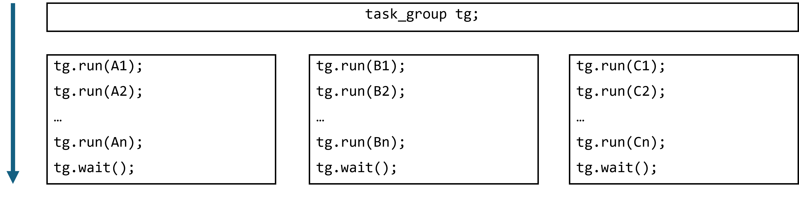
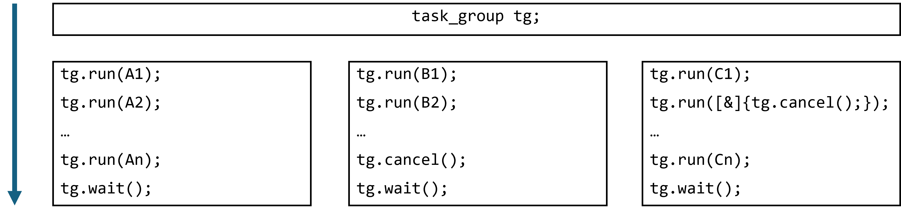

.. _task_group_thread_safety:

task_group Thread Safety
========================

The use of a shared ``task_group`` object across different threads is safe and easy to reason about
in many common cases, such as recursive algorithms. But sometimes it is difficult
to reason about the concurrent use of a single shared ``task_group`` across threads.

In :ref:`creating_tasks_with_task_group`, tasks that are executing within a ``task_group`` add more tasks
by calling ``run`` on the same ``task_group`` object. The call to ``task_group::wait`` is then made
from the single thread that started the recursive parallel algorithm. The calls to ``run`` are logically nested
within a recursive algorithm and that single call to ``wait`` is guaranteed to wait
for all of the children tasks, even those added from other worker threads.

In less structured cases with calls to both ``task_group::run`` and ``task_group::wait`` on the same object
from different threads, the behavior is more sophisticated. Here is a diagram that shows a single ``task_group``
object that is accessed in parallel by three different threads. Each thread runs some tasks and then calls wait
on the shared ``task_group``:

.. container:: fignone
   :name: concurrent_tasks

   .. container:: imagecenter

      |image0|

If none of the tasks run in the ``task_group`` throw an exception or cancel the execution of the
``task_group``, there are two execution guarantees.

First, all tasks created by calls to ``run`` that *happen before* a call to ``wait`` on the same thread 
are guaranteed to be complete when the call to wait returns. So for example, the thread that runs the
`A` tasks is guaranteed to wait for all the `A` tasks in its call to ``wait``. 

Second, any ``run`` that *inter-thread happens before* a call to ``wait`` on another thread will be complete
when that call to ``wait`` returns.

Both of these guarantees mean that if you use C++ mechanisms to order the calls to ``run``
and ``wait`` on the same ``task_group``, this ordering will be respected. But if you do not
enforce an ordering, task submissions and waits on different threads are not synchronized.
That is, it is unknown if a task in the ``task_group`` will be complete when
a ``wait`` on that ``task_group`` by another thread returns.

Use of cancellation or exceptions complicates the semantics of concurrent calls to ``wait``
on the same ``task_group`` object. An example of task cancellation in a ``task_group`` can
be found in :ref:`Cancellation_Without_An_Exception`.

The ``task_group::wait`` function resets the ``task_group_context`` associated
with the ``task_group``. Cancellations or exceptions combined with concurrent calls to ``wait`` on a shared
``task_group`` can result in behavior that may seem unexpected or difficult to reason about. 

The following diagram shows three threads that call ``run``, ``wait`` and ``cancel`` on a
shared ``task_group``.  The execution guarantees described above no longer hold for this example.

.. container:: fignone
   :name: concurrent_tasks_canceled

   .. container:: imagecenter

      |image1|

In this diagram, there is no guarantee that all of the `A` tasks complete, since an intervening call
to ``cancel`` on another thread may cancel their execution. 

For the thread that runs the `B` tasks, we may expect the call to ``wait`` to return a status of
``canceled``. However, an intervening call to ``wait`` on another thread, which results in a reset of the
``task_group_context``, may cause the call to ``wait`` on the thread that executes the `B` tasks to return
a status other than ``canceled``.

A thread that has canceled a ``task_group`` and then ``runs`` more tasks may see those tasks execute because
a ``wait`` on another thread completed and reset the ``task_group`` before those tasks were ``run``, effectively
uncanceling the ``task_group``.

Exceptions that are thrown from a ``task_group`` task cause the cancellation of the ``task_group``, so
applications that throw exceptions and have concurrent waits can have similarly complicated behavior. In
addition, exceptions that originate in tasks ``run`` in a ``task_group`` by one thread may propagate to the call
to ``wait`` on another thread.

Due to the lack of meaningful guarantees for cancellation and exception handling in these situations,
we recommend that concurrent calls to ``wait`` be used only in cases where there is no possibility of
concurrent cancellations or exceptions.
