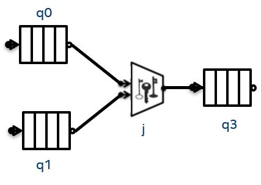

# Type-specified message keys for join_node

## Introduction

A key matching `join_node` requires developers to provide a function for each input port to map the
input type to the key type. This experimental extension simplifies the existing approach by calling the
`key` member function in the input type when available instead, removing the need to provide a function
per port during construction. Users can alternatively overload a `key_from_message` function for their
input type and it will be used if found by ADL.

Let's consider the following graph that has two `queue_nodes` named `q0` and `q1` that are connected to a
key matching `join_node j` that is then connected to a final `queue_node` named `q3`:



The code to implement such a graph is shown below, with the message type `Message`.

```cpp
#include "oneapi/tbb/flow_graph.h"
#include <iostream>

namespace msg {
    template<typename K>
    struct Message {
        K k;
        int v;
    };

    template <typename K>
    std::ostream& operator<<(std::ostream& os, const Message<K>& m) {
        os << "(" << m.k << ", " << m.v << ")";
        return os;
    }
}

int main(int argc, char *argv[]) {
    using msg_t = msg::Message<int>;
    tbb::flow::graph g;

    tbb::flow::queue_node<msg_t> q0{g};
    tbb::flow::queue_node<msg_t> q1{g};

    tbb::flow::join_node<std::tuple<msg_t, msg_t>, tbb::flow::key_matching<int>> 
    j{g, [](const msg_t& m) { return m.k; }, [](const msg_t& m) { return m.k; } };

    tbb::flow::queue_node<std::tuple<msg_t,msg_t>> q3{g};

    tbb::flow::make_edge(q0, tbb::flow::input_port<0>(j));
    tbb::flow::make_edge(q1, tbb::flow::input_port<1>(j));
    tbb::flow::make_edge(j, q3);

    int n = 10;
    for (int i = 1; i < n; ++i) {
       q0.try_put(msg_t{i, 1000+i});
       q1.try_put(msg_t{n-i, 10000+i});
    }
    g.wait_for_all();

    for (int i = 1; i < n; ++i) {
        std::tuple<msg_t, msg_t> t;
        q3.try_get(t);
        std::cout << std::get<0>(t) << ":" << std::get<1>(t) << std::endl;
    }
    return 0;
}

```

The key part to note in the example is the definition of `join_node j`:

```cpp
    tbb::flow::join_node<std::tuple<msg_t, msg_t>, tbb::flow::key_matching<int>> 
    j{g, [](const msg_t& m) { return m.k; }, [](const msg_t& m) { return m.k; } };
```

For each input port, a function object must be provided to get the key from the incoming message.
For this example, there are two identical lambda expressions passed, `[](const msg_t& m) { return m.k; }`.
If a `join_node` has 10 ports, there will need to be 10 function objects passed to the constructor.

This experimental extension simplifies the use of key matching `join_node` by providing a way to associate a
key function with the message type instead of specifying it manually for each input port.

## Experimental Feature

This experimental feature first appeared in 2015 and likely needs modernization before going into
production. Here we describe the feature as-is, and intend to use this document as a reference
for proposals for modifications.

The extension adds a special constructor to the `join_node` interface when the
`key_matching<typename K, class KHash=tbb_hash_compare>` policy is used. The constructor has the
following signature:

```cpp
    join_node( graph &g )
```

When constructed this way, a `join_node` calls the `key_from_message` function for each incoming
message to obtain the key associated with it. The default implementation of `key_from_message`
is the following:

```cpp
namespace oneapi {
    namespace tbb {
        namespace flow {
            template <typename K, typename T>
            K key_from_message( const T &t ) {
                return t.key();
            }
        }
    }
}
```

`T` is one of the user-provided types in `OutputTuple` of the `join_node` and is used to construct
the `join_node`, and `K` is the key type of the node. In this default implementation, the `key()` method
defined in the message class will be called. Alternatively, the user can define their own `key_from_message`
function in the same namespace with the message type. This function will be found via C++ argument-dependent
lookup (ADL) and used in place of the default implementation. The `key_from_message` function is invoked
from the body object constructed by the `join_node` using an explicit template argument and so the function
must be a template with at least the key type as a template parameter:


```cpp
    template <typename K, typename T>
    struct key_from_message_body {
        K operator()(const T& t) const {
            return key_from_message<K>(t);
        }
    };
    // Adds const to reference type
    template <typename K, typename T>
    struct key_from_message_body<K&,T> {
        const K& operator()(const T& t) const {
            return key_from_message<const K&>(t);
        }
    };
```

The initial example is rewritten below with both options for using the less verbose constructor.
When compiled with the `USE_FUNCTION` macro defined, the code will add a member function `key()`
to the `struct Message` which the default `key_from_message` will use. If instead, the
`USE_ADL` macro is defined, then the code defines its own `key_from_message` function in the
same namespace as `struct Message` and this function will be found by ADL.

Simplifying key calculation from incoming messages remains desirable but the approach proposed
in 2015 may no longer be the best approach. Before productization, alternatives should be
considered as mentioned in the Exit Criteria.

```cpp
#define TBB_PREVIEW_FLOW_GRAPH_FEATURES 1
#include "oneapi/tbb/flow_graph.h"
#include <iostream>

namespace msg {
    template<typename K>
    struct Message {
        K k;
        int v;
#if USE_FUNCTION
        K key() const {
            std::cout << "called key()\n"; 
            return k; 
        }
#endif
    };

    template <typename K>
    std::ostream& operator<<(std::ostream& os, const Message<K>& m) {
        os << "(" << m.k << ", " << m.v << ")";
        return os;
    }

#if USE_ADL
    template <typename K>
    K key_from_message(const Message<K>& m) {
        std::cout << "used ADL\n"; 
        return m.k;
    }
#endif
}

int main(int argc, char *argv[]) {
    using msg_t = msg::Message<int>;
    tbb::flow::graph g;

    tbb::flow::queue_node<msg_t> q0{g};
    tbb::flow::queue_node<msg_t> q1{g};

#if USE_FUNCTION || USE_ADL
    tbb::flow::join_node<std::tuple<msg_t, msg_t>, tbb::flow::key_matching<int>> j{g};
#else
    tbb::flow::join_node<std::tuple<msg_t, msg_t>, tbb::flow::key_matching<int>> 
    j{g, [](const msg_t& m) { return m.k; }, [](const msg_t& m) { return m.k; } };
#endif

    tbb::flow::queue_node<std::tuple<msg_t,msg_t>> q3{g};

    tbb::flow::make_edge(q0, tbb::flow::input_port<0>(j));
    tbb::flow::make_edge(q1, tbb::flow::input_port<1>(j));
    tbb::flow::make_edge(j, q3);

    int n = 10;
    for (int i = 1; i < n; ++i) {
       q0.try_put(msg_t{i, 1000+i});
       q1.try_put(msg_t{n-i, 10000+i});
    }
    g.wait_for_all();

    for (int i = 1; i < n; ++i) {
        std::tuple<msg_t, msg_t> t;
        q3.try_get(t);
        std::cout << std::get<0>(t) << ":" << std::get<1>(t) << std::endl;
    }
    return 0;
}
```

As an already released experimental feature, this extension is documented in the
[Developer Guide](https://www.intel.com/content/www/us/en/docs/onetbb/developer-guide-api-reference/2022-0/type-specified-message-keys-for-join-node.html)

## Exit Criteria

The following conditions need to be met to move the feature from experimental to fully supported:
* Modernize the approach:
  * Is an optional `key()` member function and ADL of `key_from_message_body` still the best
  approach for simplification?
  * Consider alternatives.
* The feature must be added to the oneTBB specification and accepted.
