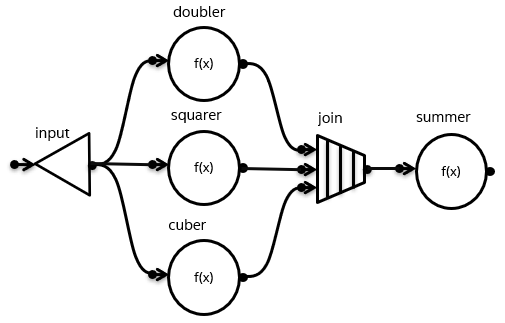
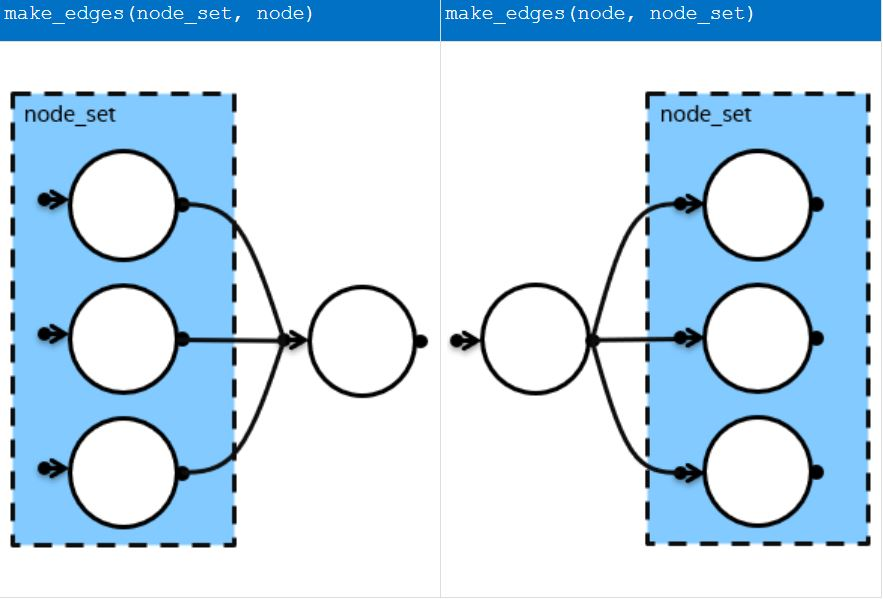

# Helper Functions for Expressing Flow Graphs

## Introduction

The production flow graph API lacks a simple way to create multiple edges with a single call. The result of this
limitation is verbose, less-readable code.  For example, the following picture shows a flow graph where the
node `input` has three successors.



Without this experimental extension, three separate calls to `make_edge` are required to connect the
single `input` node to its three successors: 

```cpp
    broadcast_node<int> input(g);

    function_node doubler(g, unlimited, [](const int& v) { return 2 * v; });
    function_node squarer(g, unlimited, [](const int&) { return v * v; });
    function_node cuber(g, unlimited, [](const int& v) { return v * v * v; });

    make_edge(input, doubler);
    make_edge(input, squarer);
    make_edge(input, cuber);
```

To reduce verbosity and improve readability, additional functions were added to the flow graph API
to simplify these cases. A shorter and more readable implementation of the previous code snippet that
uses these extensions is shown below:

```cpp
    function_node doubler(g, unlimited, [](const int& v) { return 2 * v; });
    function_node squarer(g, unlimited, [](const int&) { return v * v; });
    function_node cuber(g, unlimited, [](const int& v) { return v * v * v; });

    broadcast_node input(precedes(doubler, squarer, cuber));
```

## Experimental Feature

Several helper functions and additional constructors have been added as experimental features.
These additions simplify expressing dependencies between nodes when building oneTBB flow graphs.
This experimental feature is described in more detail in the
[Reference Guide](https://uxlfoundation.github.io/oneTBB/main/reference/helpers_for_expressing_graphs.html)

There are four main parts to the extension:

- `make_node_set` function template
- `make_edges` function template
- additional constructors for some, but not all, flow graph node types
- `follows` and `precedes` function templates

### Node Sets

In the current experimental feature documentation, `node_set` is an exposition-only name for the
type returned from the `make_node_set` function. The `make_node_set` function creates a
set of nodes that can be passed as arguments to the `make_edges`, `make_edges_in_order`, `follows`
and `precedes` functions that are described in later sections. All nodes in a `node_set` should
be from the same graph, but this is not enforced. Including nodes from more than one graph in a
`node_set` results in undefined behavior.

```cpp
    // node_set is an exposition-only name for the type returned from make_node_set function

    template <typename Node, typename... Nodes>
    /*unspecified*/ make_node_set( Node& node, Nodes&... nodes );
```

Currently, `node_set` is a template struct as shown below. The function `make_node_set` creates a
`node_set` using `order::undefined` as the first class template argument. The `precedes` and 
`follows` functions, described in [the next section](#follows-and-precedes-helper-functions),
create  node sets with `order::following` or `order::preceding`.

```cpp
namespace tbb {

namespace flow {

    namespace order {
    struct undefined {};
    struct following {};
    struct preceding {};
    }

    template<typename Order, typename... Nodes>
    struct node_set {
        typedef Order order_type;

        std::tuple<Nodes&...> nodes;
        node_set(Nodes&... ns) : nodes(ns...) {}

        template <typename... Nodes2>
        node_set(const node_set<order::undefined, Nodes2...>& set) : nodes(set.nodes) {}

        graph& graph_reference() const {
            return get_graph_helper::get(std::get<0>(nodes));
        }
    };

    template <typename Node, typename... Nodes>
    node_set<order::undefined, Node, Nodes...>
    make_node_set(Node& first_node, Nodes&... nodes) {
        return node_set<order::undefined, Node, Nodes...>(first_node, nodes...);
    }

}
}
```

**NOTE:** the member function `graph_reference` in `node_set` assumes that all nodes belong to the same graph, 
since it returns the graph associated with the first node in the set. 
In the [the additional constructors](#additional-constructors-for-flow-graph-nodes), a `node_set` object
replaces the `graph` object argument, and the graph reference is obtained in the constructor by calling
this function.

### `follows` and `precedes` Helper Functions

These functions create a `node_set` with an `order::following` or an `order::preceding` order type. 
The signatures of the `follows` and `precedes` functions are shown below:

```cpp
    // node_set is an exposition-only name for the type returned from make_node_set function

    template <typename NodeType, typename... NodeTypes>
    /*unspecified*/ follows( node_set<NodeType, NodeTypes...>& set );  // [1]

    template <typename NodeType, typename... NodeTypes>
    /*unspecified*/ follows( NodeType& node, NodeTypes&... nodes );    // [2]

    template <typename NodeType, typename... NodeTypes>
    /*unspecified*/ precedes( node_set<NodeType, NodeTypes...>& set ); // [3]

    template <typename NodeType, typename... NodeTypes>
    /*unspecified*/ precedes( NodeType& node, NodeTypes&... nodes );   // [4]
```

The template functions `[1]` and `[3]` take a `node_set` and construct a new `node_set` with
the ordering added. For example, the code below creates a `node_set` that contains nodes
`n1`, `n2` and `n3` that become the successors of a new node `n0`:

```cpp
  auto handlers = make_node_set(n1, n2, n3);
  broadcast_node<int> n0(precedes(handlers));
```

In the above code, the `node_set handlers` is constructed with `order::undefined` and
the call to `precedes` creates a new set that is constructed with `order::preceding`.

The template functions `[2]` and `[4]` take a sequence of nodes and create a node set that has
an `order::following` or `order::preceding` order type. The following code is equivalent to the
previous example:

```cpp
  broadcast_node<int> n0(precedes(n1, n2, n3));
```

One area for useful feedback is whether the semantics of `precedes` and `follows` are clear. The order type of a
node set,`order::following` or `order::preceding`, does not describe a property that is intrinsic to the node
set itself, but instead describes the ordering of the yet-to-be-constructed node, **N**, relative to the nodes in the 
`node_set`. An `order::following` node set becomes predecessors to **N**, since **N** is *following*
the nodes in the set; while an `order::preceding` set becomes successors of **N**, since **N** is `preceding`
the nodes in the set.

To be more concrete, below is based on the implementation of `precedes` in the current experimental code:

```cpp
template<typename FirstSuccessor, typename... Successors>
node_set<order::preceding, FirstSuccessor, Successors...>
precedes(FirstSuccessor& first_successor, Successors&... successors) {
    return node_set<order::preceding, FirstSuccessor, Successors...>(first_successor, successors...);
}
```

The arguments to the `precedes` functions (eventually) become successors to a new node, and therefore the arguments
 to `precedes` are named `successors` and the `node_set` is constructed with an `order::preceding` order type.
 
 Is it confusing that a `preceding` node set contains nodes that are (eventually) successors, not predecessors?
 And that a `following` node set contains nodes that are (eventually) predecessors, not successors?
 If we define the `node_set` type in the specification instead of leaving it as an exposition-only name, does that
 increase potential confusion since this allows the details of `node_set` to be viewed in isolation.  

### The `make_edges` function template

The `make_edges` function template creates edges between a single node and each node in a set of nodes.

There are two ways to connect nodes in a set and a single node using make_edges:



The order of the arguments determines the predecessor / successor relationship. The node or nodes represented
by the left argument becomes the predecessor or predecessors of the node or nodes represented by the right
argument. The signatures are shown below.

```cpp
template<typename NodeType, typename OrderFlagType, typename... Args>
void make_edges(const node_set<OrderFlagType, Args...>& s, NodeType& node);

template <typename NodeType, typename OrderFlagType, typename... Args>
void make_edges(NodeType& node, const node_set<OrderFlagType, Args...>& s);
```

In the experimental code, there is an additional `make_edges_in_order` function template that always
receives the `node_set` as the first argument. It does not accept sets where the order
type is `order::undefined`. This function is currently used to simplify definition of constructors
and is not documented as a user-facing function.

```cpp
template <typename NodeType, typename... Nodes>
void make_edges_in_order(const node_set<order::following, Nodes...>& ns, NodeType& node);

template <typename NodeType, typename... Nodes>
void make_edges_in_order(const node_set<order::preceding, Nodes...>& ns, NodeType& node);
```

**NOTE:** The `make_edges` and `make_edges_in_order` functions are defined to work for nodes
that have a single input or output port. Multi-input or multi-output nodes are special cases
that are considered in the [next section](#additional-constructors-for-flow-graph-nodes).

## Additional Constructors for Flow Graph nodes

Most flow graph nodes have been extended with new constructors that receive either an `order::following`
set or an `order::preceding` set. These node sets are created using the `precedes` and `follows` helper functions
described [earlier](#follows-and-precedes-helper-functions).

The object returned by `follows` or `precedes` is used in place of the constructor's graph argument. The graph argument
for the node being constructed is then obtained by calling `node_set::graph_reference()`, which gets the graph associated
with the first node in the set. As noted earlier, it is assumed that all nodes in a `node_set` belong to a single common graph.

### Single input, single output nodes

The nodes that do not require special cases for their constructors are shown below. These node types all have
a single input port and a single output port, and so can receive node sets that are constructed with either
`order::following` or `order::preceding`.

```cpp
    // continue_node
    template <typename Body, typename... Args>
    continue_node( const node_set<Args...>& nodes, Body body,
                   Policy p = Policy(), node_priority_t a_priority = no_priority );

    template <typename Body, typename... Args>
    continue_node( const node_set<Args...>& nodes, Body body, node_priority_t a_priority);

    template <typename Body, typename... Args>
    continue_node( const node_set<Args...>& nodes, int number_of_predecessors,
                   Body body, Policy p = Policy(), node_priority_t a_priority = no_priority );

    template <typename Body, typename... Args>
    continue_node( const node_set<Args...>& nodes, int number_of_predecessors,
                   Body body, node_priority_t a_priority );

    // function_node
    template <typename Body, typename... Args>
    function_node( const node_set<Args...>& nodes, size_t concurrency, Body body,
                   Policy p = Policy(), node_priority_t a_priority = no_priority );
    
    template <typename Body, typename... Args>
    function_node( const node_set<Args...>& nodes, size_t concurrency, Body body, node_priority_t a_priority );

    // async_node
    template <typename Body, typename... Args>
    async_node(
        const node_set<Args...>& nodes, size_t concurrency, Body body,
        Policy = Policy(), node_priority_t a_priority = no_priority );
    
    template <typename Body, typename... Args>
    async_node(const node_set<Args...>& nodes, size_t concurrency, Body body, node_priority_t a_priority);

    // overwrite_node
    template <typename... Args>
    overwrite_node(const node_set<Args...>& nodes);

    // write_once_node
    template <typename... Args>
    write_once_node(const node_set<Args...>& nodes);

    // buffer_node
    template <typename... Args>
    buffer_node(const node_set<Args...>& nodes);

    // queue_node
    template <typename... Args>
    queue_node( const node_set<Args...>& nodes);

    // priority_queue_node
    template <typename... Args>
    priority_queue_node(const node_set<Args...>& nodes, const Compare& comp = Compare());

    // sequencer_node
    template <typename Sequencer, typename... Args>
    sequencer_node( const node_set<Args...>& nodes, const Sequencer& s);

    // limiter_node
    template <typename... Args>
    limiter_node(const node_set<Args...>& nodes, size_t threshold);

    // broadcast_node
    template <typename... Args>
    broadcast_node(const node_set<Args...>& nodes);
```

### No input, single output node

An `input_node` does *NOT* have an input port, so it can only receive a node set with
`order::preceding`.

```cpp
    // input_node
    // NOTE: an input_node has no input port itself, so cannot receive an order::following node_set
    template <typename Body, typename... Successors>
    input_node( const node_set<order::preceding, Successors...>& successors, Body body );
```

### Single input, multiple output nodes

Nodes with multiple output ports are special case and include `multifunction_node` and `split_node`.
If the node's constructor receives an `order::following` node set, the rule is the same as
for the simpler node types. All of the nodes in the `order::following` set become predecessors to the
new node and are connected by an edge to its single input port. 

However, if the node's constructor receives an `order::preceding` node set, it is unclear which output
port to connect to which successor node(s). So, a simple special case rule is used. First, the size of the
`node_set` must be exactly equal to the number of output ports. Then during construction, a single edge is
created between each output port to the node with the same index in the `node_set`.

The constructors for the multi-output nodes are shown below:

```cpp
    // multifunction_node
    // Has a single input port and multiple output ports
    template <typename Body, typename... Args>
    multifunction_node(const node_set<Args...>& nodes, size_t concurrency, Body body,
                       Policy p = Policy(), node_priority_t a_priority = no_priority);
    
    template <typename Body, typename... Args>
    multifunction_node(const node_set<Args...>& nodes, size_t concurrency, Body body, node_priority_t a_priority);

    // split_node
    // Has a single input port and multiple output ports
    template <typename... Args>
    split_node(const node_set<Args...>& nodes);
```

For example in the following code, the use of `tbb::flow::precedes(n2, n3)` causes two edges
to be created ``output_port<0>(n1) --> n2`` and ``output_port<1>(n1) --> n3``.

```cpp
  int main()
  {
      tbb::flow::graph g;

      tbb::flow::function_node<int,int> n2{ g, 1,
          [](int msg) {
              std::printf("2:%d\n", msg);
              return msg;
          } };

      tbb::flow::function_node<int,int> n3(g, 1,
          [](int msg) {
              std::printf("3:%d\n", msg);
              return msg;
          });

      using mfn_t = tbb::flow::multifunction_node<int, std::tuple<int, int> >;
      mfn_t n1(tbb::flow::precedes(n2, n3), 1,
          [](int msg, mfn_t::output_ports_type& p) {
              std::printf("1:%d\n", msg);
              std::get<0>(p).try_put(msg * 2);
              std::get<1>(p).try_put(msg * 4);
          });

      n1.try_put(100);
      g.wait_for_all();
      return 0;
  }
```

During a test run, the above code resulted in the following output, showing that
`100` was sent to `n1`, which sent `100*2` to the first node in the node set, `n2`,
and sent `100*4` to the second node in the node set, `n3`.

```
  1:100
  3:400
  2:200
```

### Single output, multiple input nodes

Nodes with multiple input ports are also a special case and include `join_node` and `indexer_node`.
If the node's constructor receives an `order::preceding` node set, the rule is the same as
for the simpler node types. All of the nodes in the `order::preceding` set become successors to the
new node and are connected by an edge to its single output port. 

However, if the node's constructor receives an `order::following` node set, it is again unclear which input
port to connect to which predecessor node(s). So, a special case rule is used. Like with the 
multi-output nodes, the size of the `node_set` must be exactly equal to the number of input ports. Then during
construction, a single edge is created from each node in the `node_set` to the input port with the same index.

The constructors for the multi-input nodes are show below:

```cpp
    // join_node
    // Has multiple input ports and a single output port
    template <typename... Args>
    join_node(const node_set<Args...>& nodes, Policy = Policy());

    // indexer_node
    // Has multiple input ports and a single output port
    template <typename... Args>
    indexer_node(const node_set<Args...>& nodes);
```

### Points to note about the additional constructors

- For both the common and special cases, a constructor receives either a set of predecessor nodes or a set of successor nodes,
but not both.
- The type of set determines the ordering relationship, unlike for `make_edges` where
the predecessor / successor relationship is inferred from the relative ordering of the
arguments.
- There is currently no support for `composite_node`.

## Explicit Deduction Guides

Flow graph nodes support class template argument deduction (since C++17) and the experimental support
implemented for this proposal includes some additional explicit deduction guides. These new guides
are enabled by the additional information present in the `node_set` argument.

### For nodes with callables

For some nodes that have user-provided callables, such as `function_node`, `continue_node`,
or `sequencer_node`, explicit deduction guides are based on the callable and not related to
`node_set` support, so those will not be discussed here in any detail.

There are currently no explicit deduction guides for `multifunction_node` and `async_node`.
Support for these nodes is not included in the current experimental support and whether support
can be added needs further investigation.

### For nodes with a single common input and output type

For nodes that have a single, common input and output type, this common type may be deduced from
the `node_set` passed in place of the graph argument. The graph object itself does not provide
sufficient information, but the input or output type of a node from the `node_set` can be used.
The `node_set` support therefore introduces a new way to deduce the class template argument.
Using this approach, additional support has been added for `overwrite_node`, `write_once_node`,
`broadcast_node`, `buffer_node`, `queue_node`, `priority_queue_node` and `limiter_node`:

```cpp
template <typename NodeSet>
struct decide_on_set;

template <typename Node, typename... Nodes>
struct decide_on_set<node_set<order::following, Node, Nodes...>> {
    using type = typename Node::output_type;
};

template <typename Node, typename... Nodes>
struct decide_on_set<node_set<order::preceding, Node, Nodes...>> {
    using type = typename Node::input_type;
};

template <typename NodeSet>
using decide_on_set_t = typename decide_on_set<std::decay_t<NodeSet>>::type;

template <typename NodeSet>
overwrite_node(const NodeSet&)
->overwrite_node<decide_on_set_t<NodeSet>>;

template <typename NodeSet>
write_once_node(const NodeSet&)
->write_once_node<decide_on_set_t<NodeSet>>;

template <typename NodeSet>
buffer_node(const NodeSet&)
->buffer_node<decide_on_set_t<NodeSet>>;

template <typename NodeSet>
queue_node(const NodeSet&)
->queue_node<decide_on_set_t<NodeSet>>;

template <typename NodeSet, typename Compare>
priority_queue_node(const NodeSet&, const Compare&)
->priority_queue_node<decide_on_set_t<NodeSet>, Compare>;

template <typename NodeSet>
priority_queue_node(const NodeSet&)
->priority_queue_node<decide_on_set_t<NodeSet>, std::less<decide_on_set_t<NodeSet>>>;

template <typename NodeSet>
limiter_node(const NodeSet&, size_t)
->limiter_node<decide_on_set_t<NodeSet>>;

template <typename NodeSet>
broadcast_node(const NodeSet&)
->broadcast_node<decide_on_set_t<NodeSet>>;
```

### For multi-input nodes

For the multi-input node types (`join_node` and `indexer_node`), the `node_set` introduces
a new opportunity to deduce the class template arguments. If an `order::following` node
set is provided, the node set contains N nodes, one for each of the input ports:

```cpp
// join_node
template <typename Policy, typename... Predecessors>
join_node(const node_set<order::following, Predecessors...>&, Policy)
->join_node<std::tuple<typename Predecessors::output_type...>,
            Policy>;

template <typename... Predecessors>
join_node(const node_set<order::following, Predecessors...>)
->join_node<std::tuple<typename Predecessors::output_type...>,
            queueing>;

// indexer_node
template <typename... Predecessors>
indexer_node(const node_set<order::following, Predecessors...>&)
->indexer_node<typename Predecessors::output_type...>;
```

If an `order::preceding` node set is provided, then each of the nodes in the set
is attached to the single output port of the node and the tuple type
for `join_node` is deduced directly from the first node in the node set.
Currently there is no explicit deduction guide for `indexer_node` in this case.

```cpp
// join_node
template <typename Policy, typename Successor, typename... Successors>
join_node(const node_set<order::preceding, Successor, Successors...>&, Policy)
->join_node<typename Successor::input_type, Policy>;

template <typename Successor, typename... Successors>
join_node(const node_set<order::preceding, Successor, Successors...>)
->join_node<typename Successor::input_type, queueing>;
```

### For multi-output nodes

The only multi-output node that does not use the callable for deduction is
`split_node` and using a `node_set` now provides an opportunity to deduce the
class template arguments for `split_node`:

```cpp
template <typename Predecessor, typename... Predecessors>
split_node(const node_set<order::following, Predecessor, Predecessors...>&)
->split_node<typename Predecessor::output_type>;

template <typename... Successors>
split_node(const node_set<order::preceding, Successors...>&)
->split_node<std::tuple<typename Successors::input_type...>>;
```

## Open Questions and Exit Criteria

### Open Questions

* Is it acceptable that constructors can be used to set predecessors or successors but not both at the same time?
* Are the special case rules for multiport nodes the expected ones?
* Should `node_set` be defined or left as an exposition-only type?
  * If `node_set` is defined, are the semantics clear or is the naming of the order type potentially confusing?
* Should `node_set` support be added to:
  * `composite node`
  * the output of `indexer_node`
* Can `node_set` support be used to add explicit deduction guides for `multifunction_node` and `async_node`?

### Exit Criteria

* Sufficient user feedback should be obtained to settle the open questions
* The oneTBB specification must be updated and accepted
