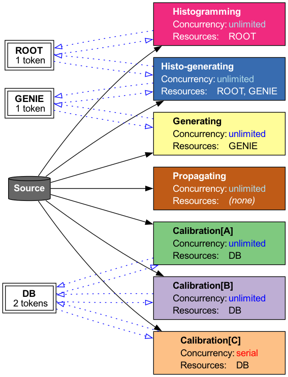
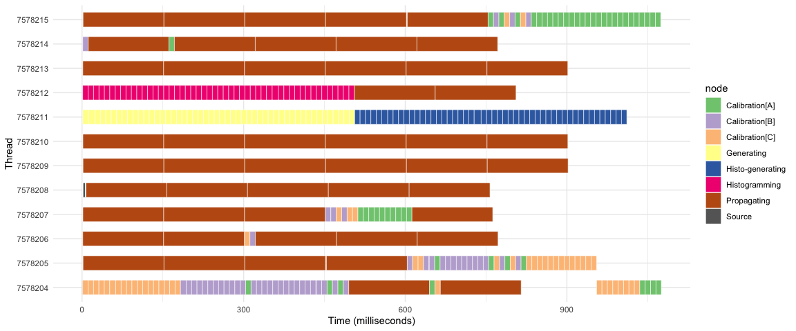
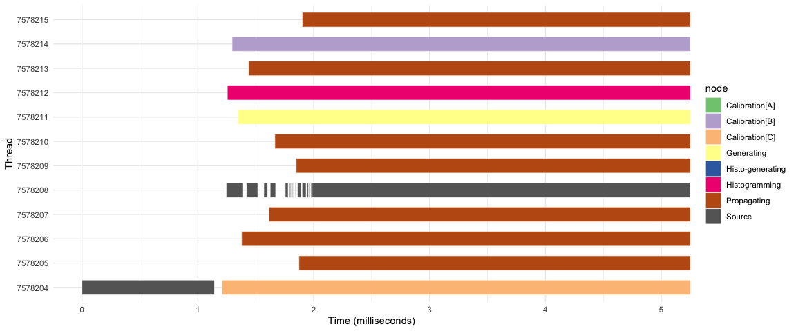
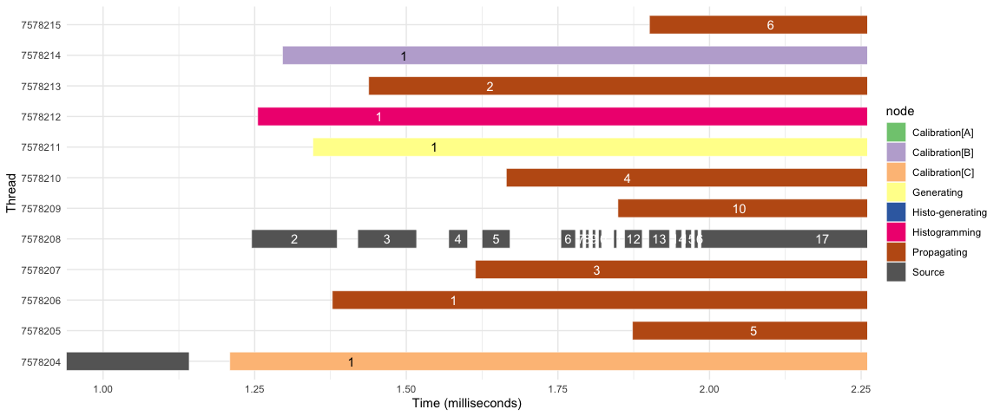
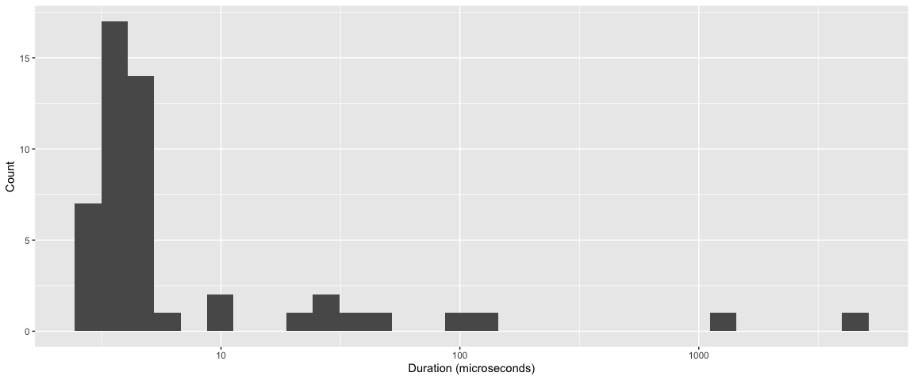
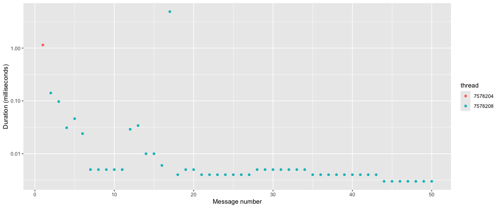
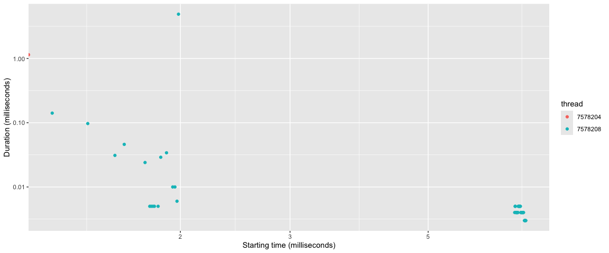
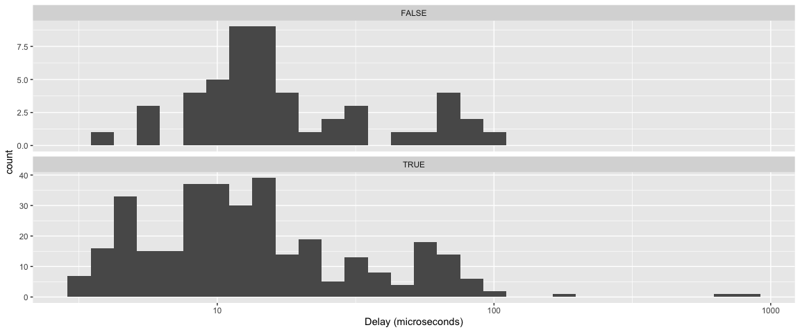

# Resource-limited Nodes


- [<span class="toc-section-number">1</span>
  Introduction](#introduction)
  - [<span class="toc-section-number">1.1</span>
    Definitions](#definitions)
- [<span class="toc-section-number">2</span> Proposal](#proposal)
- [<span class="toc-section-number">3</span> Implementation
  experience](#implementation-experience)
- [<span class="toc-section-number">4</span> Open
  Questions](#open-questions)

# Introduction

Flow-graph provides a facility to serialize the execution of a node to
allow some code that would not otherwise be thread-safe to be executed
in parallel graphs. Various flow-graph nodes accept a constructor
argument that specifies the maximum concurrency the graph can use for
that particular node. This allows one to use, in such a node, a body
that is not thread-safe, while ensuring that the graph into which the
node is inserted is thread-safe. For example, in the field of particle
physics, an algorithm might reconstruct particle trajectories (“tracks”)
from energy deposits (“hits”) left behind by those particles, and
recorded by an experiment’s detector. If the algorithm is not
thread-safe, a reasonable node construction could be:

``` cpp
using namespace tbb;
flow::graph g;

flow::function_node<Hits, Tracks> track_maker{
  g,
  flow::serial,
  [](Hits const&) -> Tracks { ... }
};
```

where the `flow::serial` argument constrains the flow graph to execute
the node body by no more than one thread at a time.

There are cases, however, when specifying a concurrency limit of
`flow::serial` is insufficient to guarantee thread safety of the full
graph. For example, suppose `track_maker` needs exclusive access to some
database connection, and another node `cluster_maker` also needs access
to the same database:

``` cpp
using namespace tbb;
flow::graph g;

DB db = db_handle(...);

flow::function_node<Hits, Tracks> track_maker{
  g,
  flow::serial,
  [&db](Hits const&) -> Tracks { auto a = db.access(/* unsafe */); ... }
};
flow::function_node<Signals, Clusters> cluster_maker{
  g,
  flow::serial,
  [&db](Signals const&) -> Clusters { auto a = db.access(/* unsafe */); ... }
};
```

In the above, the invocation of `db.access()` is not thread-safe. To
avoid data races, the function bodies of `track_maker` and
`cluster_maker` must not execute at the same time. Achieving with Flow
Graph such serialization between node bodies is nontrivial. Some options
include:

1.  placing an explicit lock around the use of the database handle,
    resulting in inefficiencies in the execution of the graph,
2.  creating explicit edges between `track_maker` and `cluster_maker`
    even though there is no obvious data dependency between them,
3.  creating a token-based system that can limit access to a shared
    resource.

This RFC proposes an interface that pursues option 3, which we describe
in the “Implementation experience” section, below. Our proposal,
however, does not mandate any implementation but suggests an API similar
to:

``` cpp
using namespace tbb;
flow::graph g;

resource_limiter<DB> db_resource{g, {db_handle()}};

rl_function_node<Hits, Tracks> track_maker{
  g,
  std::tie(db_resource),
  [](Hits const&, token<DB> db) -> Tracks { auto a = db->access(/* okay */); ... }
};
rl_function_node<Signals, Clusters> cluster_maker{
  g,
  std::tie(db_resource),
  [](Signals const&, token<DB> db) -> Clusters { auto a = db->access(/* okay */); ... }
};
```

where `db_resource` ensures limited access to a resource that both
`track_maker` and `cluster_maker` require. The implementation of the
`DB::access()` function did not change, but by connecting the
resource-limited function nodes to the `db_resource`, the bodies of the
nodes will not be invoked concurrently. Note that if the only reason
that the bodies of `track_maker` and `cluster_maker` were thread-unsafe
was their access to the limited resource indicated by `db_resource` it
is no longer necessary to declare that the nodes have concurrency
`flow::serial`. It may be possible to have the node `track_maker` active
at the same time, if the nature of `db_resource` were to allow two
handles to be available, and as long as each activation was given a
token to a different handle.

## Definitions

We use the following definitions in this proposal:

- *resource*: an entity external to the program for which access may
  need to be limited (e.g. a file on the file system, a database, a
  thread-unsafe library)
- *handle*: the program entity within the program that represents and
  provides access to the resource (the handle is not copyable as the
  resource itself cannot be copied)
- *token*: a small, copyable object passed into a node to grant access
  to the handle

# Proposal

Our proposal is an addition to what already exists and does not break
API backwards compatibility. The proposal consists of:

1. Either:
    1. Adding an `rl_function_node` class template that allows the specification of
limited resources instead of (or in addition to) a `concurrency` value (implemented for this PR), or
    2. Introducing new constructors to the relevant node types (e.g. `flow::function_node`)
that allow the specification of resource limiters, similar to what is shown in
[<span class="toc-section-number"></span>
`rl_function_node` constructors](#rl_function_node-constructors) (preferred).
2. Introducing the equivalent of a `resource_limiter` class template
that, when connected with an `rl_function_node` (or its equivalent), ensures limited access
to the resource limiter’s handles.

> [!NOTE]
> Although we pattern our proposal on the
> `flow::function_node` class template in this proposal, the concepts
> discussed here apply to nearly any flow-graph node that accepts a
> user-provided node body.

With the proposal here, in addition to what is written above we imagine
the following could be done:

``` cpp
using namespace tbb;
flow::graph g;

resource_limiter<GPU> gpus{g, {GPU{ /*gpu 1*/ }, GPU{ /*gpu 2*/}}; // Permit access to two GPUs
resource_limiter<ROOT> root{g, {ROOT{...}}};  // Only 1 ROOT handle available

rl_function_node fn{g,
                    std::tie(gpus, root), // Edges implicitly created to the required resource limiters
                    [](Hits const&, token<GPU>, token<ROOT>) -> Tracks {
                      // User has access to resource handles as arguments to function body
                      ...
                    }
                   };
```

The constructor signature for the node is similar to the regular
`flow::function_node` constructor signatures, except that instead of a
concurrency value, a `std::tuple` of resource limiters is supplied. The
node body takes an argument for the input data (i.e. `Hits`) and
(optionally) an argument corresponding to each limited resource. The
node body is invoked only when the `rl_function_node` can obtain
exclusive access to one of the resource handles provided by each
resource limiter (and when a `Hits` message has been sent to it). Note
that because two GPU handles are available, it is possible to
parallelize other work with a GPU as only each *invocation* of the node
body requires sole access to a GPU handle.

### `resource_limiter` class template

The `resource_limiter` class template heuristically looks like:

``` cpp
template <typename Handle>
using token = Handle*;

template <typename Handle = default_resource_handle>
class resource_limiter : tbb::flow::buffer_node<token<Handle>> {
public:
  using token_type = token<Handle>;

  /// \brief Constructs a resource_limiter with n_handles of type Handle.
  resource_limiter(tbb::flow::graph& g, unsigned int n_handles = 1) :
    tbb::flow::buffer_node<token_type>{g}, handles_(n_handles)
  {}
  /// \brief Constructs a resource_limiter with explicitly provided handles.
  resource_limiter(tbb::flow::graph& g, std::vector<Handle>&& handles) :
    tbb::flow::buffer_node<token_type>{g}, handles_(std::move(handles))
  {}

  /// \brief Activate the resource_limiter by placing one token to each handle
  /// it manages into its buffer.
  ///
  /// This function must be called before the flow graph is started.  It
  /// is not automatically called by the constructor because the
  /// resource_limiter may be placed into a container (e.g. a vector) that
  /// can grow after the resource_limiter is constructed.  If the
  /// resource_limiter is activated before it is placed into its final
  /// location, then the locations of the tokens in the buffer can become
  /// invalid, resulting in memory errors when the flow graph is executed.
  void activate()
  {
    // Place tokens into the buffer.
    for (auto& handle : handles_) {
      tbb::flow::buffer_node<token_type>::try_put(&handle);
    }
  }

private:
  std::vector<Handle> handles_;
};
```

where `Handle` represents the type of a resource handle for which tokens
can be passed throughout the graph. With this implementation, the token
is simply a pointer to a handle owned by the resource limiter.

#### C++20 support

When compiling with a C++ standard of at least C++20, the
`resource_limiter` `Handle` template parameter can be constrained to
model a resource-handle concept.

### Resource handles

#### User-defined resource handles

An example of a user-defined resource handle is the `DB` handle
discussed above. A handle, in principle, can have an arbitrary structure
with unlimited interface, so long as ownership of the handle ultimately
reside with the `resource_limiter`.

#### `default_resource_handle`

For `rl_function_node` function bodies that do not need to access
details of the resource, a default policy can be provided:

``` cpp
resource_limiter r{g};
```

This can be useful if a third-party library supports substantial
thread-unsafe interface and there is no obvious API that should be
attached to the handle.

### `rl_function_node` constructors

We imagine the following constructors could exist

``` cpp
using namespace tbb;
flow::graph g;

// 1. Already discussed above
rl_function_node fn1{g,
                     std::tie(gpus, root),
                     [](Hits const&, token<GPU>, token<ROOT>) -> Tracks { ... }};

// 2. No access required to a limited resource (equivalent to flow::function_node)
rl_function_node fn2{g, flow::unlimited, [](Hits const&) -> Tracks { ... }};

// 3. Access required to a limited resource, and the user body must be serialized
rl_function_node fn3{g,
                     std::make_tuple(flow::serial, std::ref(db_limiter)),
                     [](Hit const&, token<DB>) -> Tracks{ ... }};
```

Constructor 1 has already been discussed. Constructor 2 would be
equivalent (in signature and behavior) to what is already provided by
`flow::function_node`. Constructor 3 would be the rarer situation where:

- the (e.g.) `db_resource` itself may have more than one resource
  handle, thus permitting some parallelism for that resource
- the implementation of `fn3`’s user body may need to be serialized for
  reasons unrelated to the DB resource

# Implementation experience

The image below depicts a system implemented within the
https://github.com/knoepfel/meld-serial repository.


This section provides some analysis of the timing performance of the
`rl_function_node` node type as provided in
[meld-serial](https://github.com/knoepfel/meld-serial). It analyzes a
simple data flow with 7 nodes.

- One *Source* (input node) that generates a series of messages. Each
  message is represented by a single integer. As an input node, it is
  inherently serialized.
- One *Propagating* node. This node has unlimited parallelism.
- One *Histogramming* node. This node requires sole access to the *ROOT*
  resource, for which there is only one handle.
- One *Generating* node. This node require sole access to the *GENIE*
  resource, for which there is only one handle.
- One *Histo-Generating* node. This node requires simultaneous access to
  both the *ROOT* and *GENIE* resources.
- Three *Calibration* nodes. These nodes are labeled *Calibration\[A\]*,
  *Calibration\[B\]*, and *Calibration\[C\]*. Each of these nodes
  requires sole access to a *DB* handle. There are two *DB* handles
  available. *DB* handles have an associated integer ID; the values are
  1 and 13. *Calibration\[A\]* and *Calibration\[B\]* have unlimited
  concurrency but *Calibration\[C\]* is serial. This means that, at the
  same time, we can have:
  - two *Calibration\[A\]* tasks running, or
  - two *Calibration\[B\]* tasks running, or
  - one *Calibration\[A\]* task running and one *Calibration\[B\]* task
    running, or
  - one *Calibration\[A\]* task running and one *Calibration\[C\]* task
    running, or
  - one *Calibration\[B\]* task running and one *Calibration\[C\]* task
    running.

  But we cannot have two *Calibration\[C\]* tasks running at the same
  time.

The nodes are connected as shown in this diagram:




The *Source* node is directly connected to each of the other nodes by
explicitly calling `make_edge(...)`. All edges between the nodes and the
resource limiters are created internally within the `rl_function_node`
constructor. The tasks performed by the system is the generation of the
messages and the processing of each message by all the other nodes in
the system.

Each time a node is fired, we record two events. A *Start* event is
recorded as the first thing done within the body of the node. The node
then performs whatever work it is to do (for all but the *Source*, this
is a busy loop for some fixed time). A *Stop* event is recorded as the
last thing done within the body of the node. For each event, we record
the *thread* on which the event occurred, the *node* that was executing,
the *message* number, and the extra *data* associated with the event.
The extra data is meaningful only for the *Calibration* nodes; this data
is the *DB* handle ID.

The event records are used to form the `events` table. Each task is
associated with both a *Start* and a *Stop* event. These times are
measured in milliseconds since the start of the first task. The `tasks`
table is formed by pivoting the `events` table to have a single row for
each task. The *duration* of each task is the difference between the
*Stop* and *Start* times, and is also recorded in milliseconds.

The first few rows of the `tasks` table are shown in
<a href="#tbl-read-events" class="quarto-xref">Table 1</a> below.

<div id="tbl-read-events">

Table 1: First few rows of the `tasks` table.

<div class="cell-output-display">

| thread  | node             | message | data | Start |    Stop | duration |
|:--------|:-----------------|--------:|-----:|------:|--------:|---------:|
| 7578204 | Source           |       1 |    0 | 0.000 |   1.142 |    1.142 |
| 7578204 | Calibration\[C\] |       1 |    1 | 1.209 |  11.244 |   10.035 |
| 7578208 | Source           |       2 |    0 | 1.245 |   1.386 |    0.141 |
| 7578212 | Histogramming    |       1 |    0 | 1.255 |  11.292 |   10.037 |
| 7578214 | Calibration\[B\] |       1 |   13 | 1.296 |  11.327 |   10.031 |
| 7578211 | Generating       |       1 |    0 | 1.346 |  11.764 |   10.418 |
| 7578206 | Propagating      |       1 |    0 | 1.378 | 151.434 |  150.056 |
| 7578208 | Source           |       3 |    0 | 1.420 |   1.517 |    0.097 |
| 7578213 | Propagating      |       2 |    0 | 1.438 | 151.463 |  150.025 |
| 7578208 | Source           |       4 |    0 | 1.570 |   1.601 |    0.031 |
| 7578207 | Propagating      |       3 |    0 | 1.614 | 151.638 |  150.024 |
| 7578208 | Source           |       5 |    0 | 1.625 |   1.671 |    0.046 |

</div>

</div>

The graph was executed with 50 messages, on a 12-core MacBook Pro laptop
with an Apple M2 Max chip.

### Analysis of thread occupancy

Our main concern is to understand what the threads are doing, and to see
if the hardware is being used efficiently. By “efficiently”, we mean
that the threads are busy doing useful work—i.e., running our tasks.
<a href="#fig-thread-busy" class="quarto-xref">Fig. 1</a> shows the
timeline of task execution for each thread.

<div id="fig-thread-busy">



Figure 1: Task execution timeline, showing when each thread is busy and
what it is doing. This workflow was run on a 12-core laptop, using 12
threads.

</div>

The cores are all busy until about 700 milliseconds, at which time we
start getting some idle time. This is when there are no more
*Propagating* tasks to be started; this is the only node that has
unlimited parallelism. In this view, the *Source* tasks are completed so
quickly that we cannot see them.

<a href="#fig-program-start" class="quarto-xref">Fig. 2</a> zooms in on
the first 5.0 milliseconds of the program.

<div id="fig-program-start">



Figure 2: Task execution timeline, showing the startup of the program.

</div>

We can see that the *Source* is firing many times, and with a wide
spread of durations. We also see that the *Source* is serialized, as
expected for an input node. There is some small idle time after the
first firing of the *Source*, and additional delays after the next few
firings. After the first firing, all the activity for the *Source* moves
to a different thread. We do not understand the cause of the delays
between source firings, or the range of durations of the *Source* tasks.
It is possible this is related to our use of *spdlog* to log messages.

In <a href="#fig-program-start-after-first"
class="quarto-xref">Figure 3</a>, we can zoom in further to see what is
happening after the first firing of the *Source*. There are delays
between the creation of a message by the *Source* and the start of the
processing of that message by one of the other nodes, and that delay is
variable. In this plot we see that it is message 17 that has an enormous
duration for the *Source* task: 4.889 ms.

<div id="fig-program-start-after-first">



Figure 3: Task execution timeline, showing the time after the first
source firing. The numeric label in each rectangle shows the message
number being processed by the task.

</div>

We can also zoom in on the program wind-down, as shown in
<a href="#fig-program-wind-down" class="quarto-xref">Figure 4</a>. Here
it appears we have some idle threads because there is insufficient work
to be done. We also see the effect of the serial constraint on the
*Calibration\[C\]* node. While *Calibration\[A\]* and *Calibration\[B\]*
can run simultaneously on two threads, which we see in the last part of
the plot, we see that *Calibration\[C\]* is only running on one thread
at a time. We do not see any sign of unexploited parallelism.

<div id="fig-program-wind-down">


Figure 4: Task execution timeline, showing the time after the first
source firing.

</div>

### Looking at calibrations

Flow Graph seems to prefer keeping some tasks on a single thread. All of
the *Histo-generating* tasks were run on the same thread. The same is
true for *Generating* and *Histogramming* tasks. The calibrations are
clustered onto a subset of threads, and are not distributed evenly
across those threads. This is shown in
<a href="#tbl-calibrations" class="quarto-xref">Table 2</a>.

<div id="tbl-calibrations">

Table 2: Number of calibrations of each type done by each thread.

<div class="cell-output-display">

| thread  | node             |   n |
|:--------|:-----------------|----:|
| 7578204 | Calibration\[A\] |   8 |
| 7578204 | Calibration\[B\] |  28 |
| 7578204 | Calibration\[C\] |  27 |
| 7578205 | Calibration\[A\] |   4 |
| 7578205 | Calibration\[B\] |  14 |
| 7578205 | Calibration\[C\] |  17 |
| 7578206 | Calibration\[B\] |   1 |
| 7578206 | Calibration\[C\] |   1 |
| 7578207 | Calibration\[A\] |  10 |
| 7578207 | Calibration\[B\] |   3 |
| 7578207 | Calibration\[C\] |   3 |
| 7578214 | Calibration\[A\] |   1 |
| 7578214 | Calibration\[B\] |   1 |
| 7578215 | Calibration\[A\] |  27 |
| 7578215 | Calibration\[B\] |   3 |
| 7578215 | Calibration\[C\] |   2 |

</div>

</div>

### Distribution of *Source* task durations

The body of the *Source* task consists of a single increment of an
integer. From this, one might assume that the duration of *Source* tasks
would be very similar to each other, and quite short. The data show
otherwise. Focusing on the distribution of durations for the *Source*
tasks, the variation is quite striking, as shown in
<a href="#fig-source-durations" class="quarto-xref">Figure 5</a>.

<div id="fig-source-durations">



Figure 5: Distribution of durations for the Source tasks. Note the log
$x$ axis.

</div>

With such an extreme variation, we wonder if there may be some
interesting time structure. The *Source* generates numbers in sequence
and serially. Thus we can see time structure by plotting different
quantities as a function of either the sequential number (`message`)
(<a href="#fig-source-time-structure-by-message"
class="quarto-xref">Figure 6</a>) or as the starting time
(<a href="#fig-source-time-structure-by-start"
class="quarto-xref">Figure 7</a>).

<div id="fig-source-time-structure-by-message">



Figure 6: Duration of Source tasks a function of the message number. The
color of the point indicates the thread on which the task was run.

</div>

<div id="fig-source-time-structure-by-start">



Figure 7: Duration of Source tasks a function of the starting time. The
color of the point indicates the thread on which the task was run. Note
the log $x$ axis. Also note that the red point starts at time 0, but is
plotted at the edge of the graph because the log scale cannot extend to
time 0.

</div>

### Idle time between tasks

One of the concerns that some have with a system, like Flow Graph, that
automates the scheduling of tasks is the amount of time that the
scheduling system takes (as opposed to the time spent doing the user’s
defined work). We can estimate this by looking at the time between the
end of one task and the start of the next task scheduled on the same
thread. We call this time the *delay* and associate it with the second
task. We also record, for each delay, whether the previous task on the
thread was run by the same node. We find this is true for the large
majority of tasks.

There are a few delays that are much longer than others, as shown in
<a href="#tbl-long-delays" class="quarto-xref">Table 3</a>. Note that
the largest of the delays appears because the *Calibration\[C\]* node’s
tasks migrate from one thread to another; this is not a sign of an
actual idle period for the sequence of *Calibration\[C\]* tasks.

<div id="tbl-long-delays">

Table 3: Details of the delays longer than 1 millisecond.

<div class="cell-output-display">

| thread | node | message | data | Start | Stop | duration | delay | before | same |
|:---|:---|---:|---:|---:|---:|---:|---:|:---|:---|
| 7578204 | Calibration\[C\] | 43 | 1 | 955.154 | 965.164 | 10.010 | 140.029 | Propagating | FALSE |
| 7578205 | Propagating | 29 | 0 | 453.642 | 603.658 | 150.016 | 1.544 | Propagating | TRUE |
| 7578215 | Propagating | 37 | 0 | 603.757 | 753.760 | 150.003 | 1.567 | Propagating | TRUE |

</div>

</div>

<a href="#fig-delay-distribution" class="quarto-xref">Fig. 8</a> shows
the distribution of the lengths of the delays. They are typically tens
of microseconds. We observe no significant difference between the
distributions for delays for cases when the task in question was run by
the same node or by a different node.

<div id="fig-delay-distribution">



Figure 8: Distribution of delays for all delays shorter than 1
millisecond. Note the log $x$ axis. The bottom panel shows the delays
for tasks for which the previous task on the same thread was run by the
same node. The top panel shows the delays for tasks for which the
previous task on the same thread was run by a different node.

</div>

# Open Questions

1.  For node bodies that are serialized, the current implementation
    imposes serialization on the `flow::function_node` after the join of
    the tokens and the data. This means that data may accumulate at the
    `flow::function_node`’s input-port buffer, thus reserving the
    resource for longer than is desired. It would be better for the
    tokens to be returned if the function body is already being executed
    by another thread.
2.  With the implementation presented here, a live-lock situation may
    occur for nodes that require access to several limited resources.
    This is discussed in the performance results, where the
    “histo-generating” node does not execute until both the
    “histogramming” and “generating” nodes have completed their
    executions for all events.
