# API and semantics details for task group dynamic dependencies

*Note:* This document is a sub-RFC of the [umbrella RFC for task group dynamic dependencies](README.md). 

## Table of contents

* 1 [Introduction](#introduction)
* 2 [Feature Design](#feature-design)
  * 2.1 [Semantic extension for handling tasks in various states](#semantic-extension-for-handling-tasks-in-various-states)
  * 2.2 [Semantics for setting dependencies between tasks](#semantics-for-setting-dependencies-between-tasks)
  * 2.3 [Semantics for transferring successors from the currently executing task to the other task](#semantics-for-transferring-successors-from-the-currently-executing-task-to-the-other-task)
* 3 [Alternative approaches](#alternative-approaches)
  * 3.1 [``task_handle`` as a unique owner](#task_handle-as-a-unique-owner)
  * 3.2 [``task_handle`` as a shared owner](#task_handle-as-a-shared-owner)
* 4 [Functionality removed from the proposal](#functionality-removed-from-the-proposal)
  * 4.1 [Adding successors to the currently executing task](#adding-successors-to-the-currently-executing-task)
  * 4.2 [Functions for tracking the task progress](#functions-for-tracking-the-task-progress)
* 5 [API proposal](#api-proposal)
  * 5.1 [Changes in ``task_handle`` class specification](#changes-in-task_handle-class-specification)
  * 5.1 [``task_completion_handle`` class](#task_completion_handle-class)
    * 5.1.1 [Construction, destruction and assignment](#construction-destruction-and-assignment)
    * 5.1.2 [Observers](#observers)
    * 5.1.3 [Comparison operators](#comparison-operators)
  * 5.2 [Member functions of ``task_group`` class](#member-functions-of-task_group-class)
* 6 [Potential enhancements](#potential-enhancements)
  * 6.1 [Semantics for partial task tree destruction](#semantics-for-partial-task-tree-destruction)
  * 6.2 [``empty_task`` API](#empty_task-api)
  * 6.3 [Transferring successors to the task in any state](#transferring-successors-to-the-task-in-any-state)
  * 6.4 [Using a ``task_completion_handle`` as a successor](#using-a-task_completion_handle-as-a-successor)
  * 6.5 [Returning ``task_completion_handle`` from submission functions](#returning-task_completion_handle-from-submission-functions)
* 7 [Naming considerations](#naming-considerations)
* 8 [Implementation details](#implementation-details)
* 9 [Exit criteria & open questions](#exit-criteria--open-questions)
* 10 [Advanced examples](#advanced-examples)
  * 10.1 [Recursive Fibonacci](#recursive-fibonacci)
  * 10.2 [N-bodies problem](#n-bodies-problem)
  * 10.3 [Wavefront](#wavefront)
    * 10.3.1 [Non-recursive approach](#non-recursive-approach)
    * 10.3.2 [Classic recursive approach](#classic-recursive-approach)
    * 10.3.3 [Eager recursive approach](#eager-recursive-approach)
    * 10.3.4 [Combination of eager and classic approaches](#combination-of-eager-and-classic-approaches)
  * 10.4 [File Parser](#file-parser)

## Introduction

This document outlines a concrete proposal for the API and semantics of ``task_group`` extensions, as defined in the parent RFC.
The following cases are covered:
* ``task_group`` extensions that allow handling tasks in various states: `created`, `submitted`, `executing`, and `completed`.
  The existing API supports only a non-empty ``task_handle`` referring to a created task, or an empty one that refers to no task.
* An API for setting dependencies between tasks in various states.
* An API for transferring dependent tasks (i.e., successors) from an executing task to a task in any state.

## Feature Design

### Semantic extension for handling tasks in various states

The parent proposal for extending ``task_group`` with APIs for dynamic dependency management defines the following task states:
* `Created` 
* `Submitted`
* `Executing`
* `Completed`

A task enters the `created` state after ``task_group::defer`` is called and the task is registered in the ``task_group``, but before any
submission method (e.g., ``task_group::run``) is invoked. 

The task transitions to the `submitted` state when a submission method is called. At this point, it may be scheduled for execution once all its
dependencies are resolved.

The task enters the `executing` state when all its dependencies are completed and a thread begins executing its body.

Once the thread finishes executing the task body, the task transitions to the `completed` state.

The parent RFC proposes extending the ``task_handle`` to support tasks in any of the states defined above. This change
would require modifying the semantics of submission methods (such as ``task_group::run``) to accommodate ``task_handle`` objects representing tasks
in various states.

In contrast, this document proposes keeping ``task_handle`` as a unique-owning handle that either owns a task in the `created` state or owns no task.

To represent tasks in any state and to establish the dependencies for such tasks, this proposal introduces a new ``task_completion_handle`` class.

A ``task_completion_handle`` can be constructed from a ``task_handle`` that owns a created task. However, the reverse is not allowed.

```cpp
tbb::task_group tg;

tbb::task_handle handle = tg.defer([] {/*...*/}); // task is in created state, handle owns the task
tbb::task_completion_handle completion_handle = handle; // create the completion_handle for the task owned by the handle

tg.run(std::move(handle)); // task is in submitted state, handle is left in an empty state

// completion_handle is non-empty and can be used to set dependencies
```

In this approach, no semantic changes are needed for submission methods, since the semantics of ``task_handle`` remain unchanged.

Alternative approaches for handling tasks in different states are described in the [separate section](#alternative-approaches).

### Semantics for setting dependencies between tasks

Consider establishing a predecessor-successor dependency between the tasks ``predecessor`` and ``successor``—
``task_group::set_task_order(predecessor, successor)``. 

As stated in the parent RFC, a predecessor may be in any defined state, but the successor must be in the `created` state, as it may be too late
to add predecessors once the task is `executing` or `completed`.

This limitation is enforced by requiring the successor argument to be a ``task_handle``.

Let's consider the different states of the ``predecessor`` task.

If the predecessor task is in any state other than `completed` (i.e., `created`, `scheduled` or `executing`), the API registers the successor
in the predecessor's list of successors and increments the corresponding reference counter on the successor side to ensure it
is not executed before the predecessor completes. The successor task can only begin executing once its reference counter reaches zero.

If the predecessor task is in the `completed` state, the behavior of the API depends on whether its successors were transferred to another task during the execution of the task body.

If no transfer occurred, the API has no effect: the list of successors and reference counters remain unchanged, as no additional dependencies are introduced. The successor task can proceed once all other dependencies are satisfied.

If a transfer did occur - meaning the original task was replaced in the task graph by another - the API redirects the new successor to the task that previously received the original list of successors.
For the receiving task, the same state-based logic applies.

If the predecessor's state changes during registration, the API must ensure that dependencies are not added and reference counters are not incremented for tasks that have already completed.

From the implementation perspective, this API requires each predecessor task to maintain a list of successors.
The list contains pointers to vertex instances, each representing a successor task.
A vertex contains the reference counter for a successor task and the pointer to it.

A vertex instance is created when the first predecessor is registered and is reused by subsequent predecessors. 

When a predecessor task completes, it iterates through its list of successor vertices and decrements each reference counter.
When a successor's reference counter reaches zero, the task can be scheduled for execution.

To avoid unnecessary scheduling overhead, the predecessor task may bypass one of its successor tasks if the associated reference counter reaches zero and
no other task has already been bypassed from the user-provided task body.

This implementation approach is illustrated in the picture below:

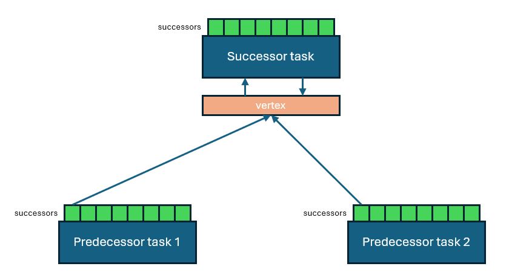

### Semantics for transferring completion from the currently executing task to the other task

Consider the use case where the completion of the task ``current`` is transferred to the task ``target``, owned by ``target_handler``. 
In this case, the API ``tbb::task_group::transfer_this_task_completion_to(target_handler)`` should be called from within the body of ``current``.

This function transfers the successors previously added to the currently executing task to ``target``.

As noted in the parent RFC, transferring outside of a task belonging to same ``task_group`` results in undefined behavior.

The current proposal limits this API to transfers from an executing task to a task in the `created` state.
Transferring to tasks in `submitted`, `executing` or `completed` states are described in a [separate section](#transferring-successors-to-the-task-in-any-state)
and may be supported in the future.

Calling ``transfer_this_task_completion_to`` merges the successor lists of ``current`` and ``target``, assigning the merged list to ``target``.
It should be thread-safe to add new successors to ``current`` using the ``set_task_order`` API.

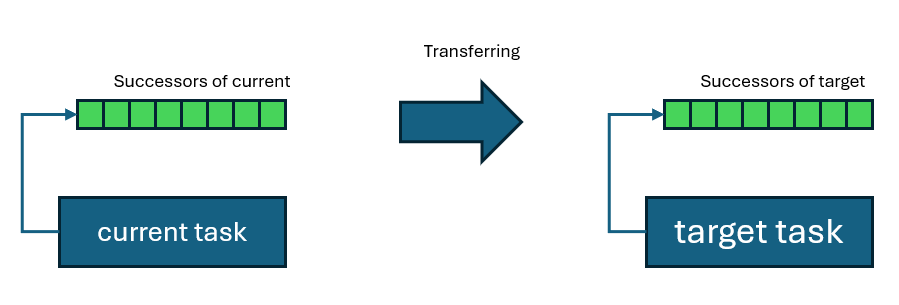

During the transfer from ``current`` to ``target``, the successor list of ``target`` includes both its original successors and those of ``current``.

An important consideration is how to manage the successor list of ``current``.

One approach is to treat ``current`` and ``target`` as separate tasks, even after transferring successors from one to the other.

In this case, after the transfer, ``current`` will have an empty successor list, and ``target`` will hold the merged list:

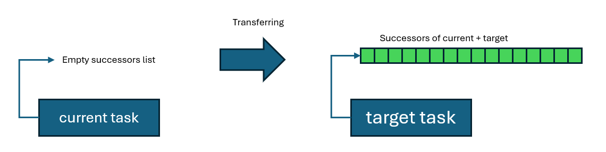

After the transfer, the successors of ``current`` and ``target`` are tracked independently. Adding new successors to one will only
affect that task's successor list:

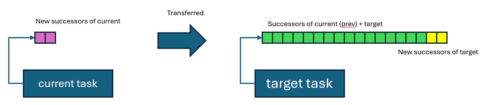

An alternative approach is to track ``current`` and ``target`` jointly after the transfer. This requires introducing a special
``task_completion_handle`` state— called a `proxy` state. If the executing task calls ``transfer_this_task_completion_to`` from within its body, all completion handles originally
created for this task transition to the `proxy` state.

When the ``current`` handle is in the `proxy` state, both ``current`` and ``target`` share a single merged successor list.

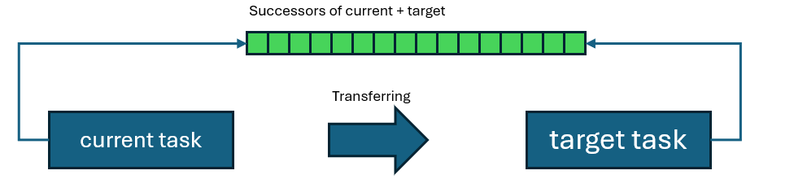

Any changes to the successor list made through either ``current`` or ``target`` will affect the same shared list —
whether adding or transferring successors, the internal state of both "real" task and `proxy` handle are updated.

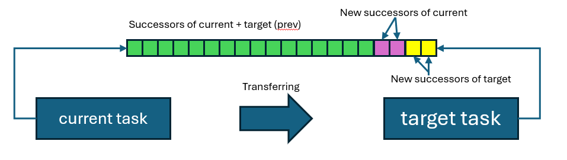

Race conditions should be considered for each approach — for example, when new successors are added to task ``A`` while it is transferring
its successors to ``B``.

There are two possible ways to linearize modification to ``A``'s successor list: the new successor may be added either before or after the
transfer to ``B``.

If ``A`` and ``B`` track their successors separately (as in the first approach), and the new successor is added before the transfer, it will be
included in the list transferred to ``B``.

If the transfer occurs before the new successor is added, it will remain associated with ``A`` and will not appear in ``B``'s successor list.

As a result, deterministic predecessor-successor relationships cannot be guaranteed due to the logical race between
``set_task_order`` and ``transfer_this_task_completion_to``.

If ``A`` and ``B`` share a merged successor list (as in the second approach), then regardless of linearization, any newly added successor will appear in 
both ``B``'s ("real" task) and ``A``'s (proxy handle) successor lists.

As illustrated in [one of the advanced examples](#combination-of-eager-and-classic-approaches), there are real-world scenarios where combined tracking
is necessary. These scenarios typically involve one thread adding a successor to a task in the `executing` state (using its ``task_completion_handle``)
while another thread replaces that task in the graph with a subtree via ``transfer_this_task_completion_to``.

Therefore, this document proposes the merged successor tracking approach.

## Alternative approaches 

Alternative approaches involve retaining ``task_handle`` as the sole mechanism to tracking task completion, setting dependencies, and submitting tasks for execution.

### ``task_handle`` as a unique owner

The first option is to keep ``task_handle`` as a unique owner of the task in various states and to allow
the use of a non-empty handle for setting or transferring dependencies.

Since the current API allows submitting a ``task_handle`` only as an rvalue, using the object after submission
(e.g., via ``task_group::run(std::move(task_handle))``) may be misleading, even if some guarantees are provided for the referenced handle.

To address this, all functions that accept a ``task_handle`` would need to be extended
with an overload that takes a non-const lvalue reference and provides the following guarantees:
* Overloads that accept an rvalue reference to ``task_handle`` require a non-empty handle and leave it in an empty state after execution (preserving current behavior).
* New overloads that accept lvalue references to ``task_handle`` also require a non-empty handle, but do not leave it in an empty state after submission. Hence, the ``task_handle`` can be
  used after the method call to represent a task in the `submitted`, `executing`, or `completed` state, and to set dependencies on such tasks.
  Reusing such a task handle in a submission function results in undefined behavior.

All submission functions would need to be extended:
* ``task_group::run`` and ``task_group::run_and_wait``
* ``task_arena::enqueue`` and ``this_task_arena::enqueue``

When ``task_group`` preview extensions are enabled, returning a non-empty ``task_handle`` referring to a task
in any state other than `created` results in undefined behavior.

### ``task_handle`` as a shared owner

Another approach is to make ``task_handle`` a shared owner, allowing multiple instances to co-own the same task.
However, since a task can be submitted for execution only once, using a
``task_handle`` in a submission function would invalidate all copies or set them
to a "weak" state, where they can only be used to set dependencies between tasks.

## Functionality removed from the proposal

### Adding successors to the currently executing task

An earlier proposal allowed adding successor tasks to the currently executing task:

```cpp
namespace oneapi {
namespace tbb {
class task_group {
public:
    struct current_task {
        static void add_successor(task_handle& successor);
    };
};
} // namespace tbb
} // namespace oneapi
```

The intended usage of this function was as follows:

```cpp
tbb::task_group tg;

tg.run_and_wait([&tg] {
    tbb::task_handle succ1 = tg.defer(...);
    tbb::task_handle succ2 = tg.defer(...);

    tbb::task_group::current_task::add_successor(succ1);
    tbb::task_group::current_task::add_successor(succ2);

    tg.run(std::move(succ1));
    tg.run(std::move(succ2));

    // Run current task's computations
    run_computations();
});
```

The `add_successor` functionality was removed, as its behavior can be replicated by reordering operations—
running successors after the current task's computations or bypassing one of them:

```cpp
tbb::task_group tg;

tg.run_and_wait([&tg] -> tbb::task_handle {
    tbb::task_handle succ1 = tg.defer(...);
    tbb::task_handle succ2 = tg.defer(...);

    // Run current task's computations
    run_computations();

    tg.run(std::move(succ1)); // run
    return std::move(succ2); // bypass
})
```

### Functions for tracking the task progress

An earlier version of the proposal included member functions in the ``task_completion_handle`` class to retrieve a task's current state:

```cpp
namespace oneapi {
namespace tbb {
class task_completion_handle {
public:
    bool was_submitted() const;
    bool is_completed() const;
};
} // namespace tbb
} // namespace oneapi
```

``was_submitted`` returns ``true`` if the task was submitted for execution using one of the APIs in ``task_group`` or
``task_arena`` (e.g., ``task_group::run``).
``is_completed`` returns ``true`` if the task has completed execution by any TBB thread.

These APIs were excluded from the final proposal for the following reasons:
* Lack of compelling use cases - existing examples could be implemented without these functions.
* Unclear semantics for these functions when the task is executing ``task_group:transfer_this_task_completion_to``.
  Consider a task ``A`` that transfers its completion to task ``B`` and exits its body. On one hand, task ``A`` has already been submitted and 
  completed, so both functions should return ``true``.
  However, since task ``A`` replaces itself in the task graph with task ``B``, it may be expected that the completion handle now
  refers to the completion of ``B``— similarly to how `set_task_order` works, where new successors added to ``A`` after the transfer are redirected to ``B``.

## API proposal

```cpp
namespace oneapi {
namespace tbb {

// Existing API
class task_handle;

// New APIs
class task_completion_handle {
public:
    task_completion_handle();

    task_completion_handle(const task_completion_handle& other);
    task_completion_handle(task_completion_handle&& other);

    task_completion_handle(const task_handle& handle);

    ~task_completion_handle();

    task_completion_handle& operator=(const task_completion_handle& other);
    task_completion_handle& operator=(task_completion_handle&& other);

    task_completion_handle& operator=(const task_handle& handle);

    explicit operator bool() const noexcept;
}; // class task_completion_handle

bool operator==(const task_completion_handle& t, std::nullptr_t) noexcept;
bool operator==(std::nullptr_t, const task_completion_handle& t) noexcept;

bool operator!=(const task_completion_handle& t, std::nullptr_t) noexcept;
bool operator!=(std::nullptr_t, const task_completion_handle& t) noexcept;

bool operator==(const task_completion_handle& t, const task_completion_handle& rhs) noexcept;
bool operator!=(const task_completion_handle& t, const task_completion_handle& rhs) noexcept;

class task_group {
    static void set_task_order(task_handle& pred, task_handle& succ);
    static void set_task_order(task_completion_handle& pred, task_handle& succ);

    static void transfer_this_task_completion_to(task_handle& h);
}; // class task_group

} // namespace tbb
} // namespace oneapi
```

### Changes in ``task_handle`` class specification

``~task_handle()``

Destroys the ``task_handle`` object and associated task if it exists.

If the associated task is a predecessor or a successor, the behavior is undefined.

### ``task_completion_handle`` class

#### Construction, destruction and assignment

``task_completion_handle()``

Constructs an empty ``task_completion_handle`` that does not refer to any task.

``task_completion_handle(const task_completion_handle& other)``

Copies ``other`` to ``*this``. After this, ``*this`` and ``other`` refer to the same task.

``task_completion_handle(task_completion_handle&& other)``

Moves ``other`` to ``*this``. After this, ``*this`` refers to the task that was referred by ``other``.
``other`` is left in an empty state.

``task_completion_handle(const task_handle& handle)``

Constructs a ``task_completion_handle`` that refers to the task owned by ``handle``.

If ``handle`` is empty, the behavior is undefined.

``~task_completion_handle()``

Destroys the ``task_completion_handle``.

``task_completion_handle& operator=(const task_completion_handle& other)``

Copy-assigns ``other`` to ``*this``.
After this, ``*this`` and ``other`` refer to the same task.

Returns a reference to ``*this``.

``task_completion_handle& operator=(task_completion_handle&& other)``

Move-assigns ``other`` to ``*this``.
After this, ``*this`` refers to the task that was referred by ``other``.
``other`` is left in an empty state.

Returns a reference to ``*this``.

``task_completion_handle& operator=(const task_handle& handle)``

Replaces task referred to by ``*this`` with the task owned by ``handle``.

If ``handle`` is empty, the behavior is undefined.

Returns a reference to ``*this``.

#### Observers

``explicit operator bool() const noexcept``

Returns ``true`` if ``*this`` refers to any task; otherwise, returns ``false``.

#### Comparison operators

``bool operator==(const task_completion_handle& t, std::nullptr_t) noexcept``

Returns ``true`` if ``t`` is empty; otherwise, returns ``false``.

``bool operator==(std::nullptr_t, const task_completion_handle& t) noexcept``

Equivalent to ``t == nullptr``.

``bool operator!=(const task_completion_handle& t, std::nullptr_t) noexcept``

Equivalent to ``!(t == nullptr)``.

``bool operator!=(std::nullptr_t, const task_completion_handle& t) noexcept``

Equivalent to ``!(t == nullptr)``.

``bool operator==(const task_completion_handle& lhs, const task_completion_handle& rhs) noexcept``

Returns ``true`` if ``lhs`` refers to the same task as ``rhs``, ``false`` otherwise.

``bool operator!=(const task_completion_handle& lhs, const task_completion_handle& rhs) noexcept``

Equivalent to ``!(lhs == rhs)``.

### Member functions of ``task_group`` class

``static void task_group::set_task_order(task_handle& pred, task_handle& succ)``

Registers the task owned by ``pred`` as a predecessor that must complete before the task owned
by ``succ`` can begin execution.

It is thread-safe to concurrently add multiple predecessors to a single successor, and to register the same predecessor for multiple successors.

It is thread-safe to add successors to both the task currently transferring its successors and the task receiving them.

The behavior is undefined in the following cases:
* ``pred`` or ``succ`` is empty.
* If tasks handled by ``pred`` and ``succ`` belong to different ``task_group``s.

``static void task_group::set_task_order(task_completion_handle& pred, task_handle& succ)``

Registers the task completion of which is handled by ``pred`` as a predecessor that must complete before the task owned
by ``succ`` can begin execution.

It is thread-safe to concurrently add multiple predecessors to a single successor, and to register the same predecessor for multiple successors.

It is thread-safe to concurrently add successors to both the task currently transferring its completion and the task receiving it.

The behavior is undefined in the following cases:
* ``pred`` or ``succ`` is empty.
* If the task completion of which is handled by ``pred`` and the task handled by ``succ`` belong to different ``task_group``s.
* If the task referred by ``pred`` was destroyed without being submitted for execution.

``static void transfer_this_task_completion_to(task_handle& h)``

Transfers the completion of the currently executing task to the task owned by ``h``.
After the transfer, the successors of the current task will be executed after the completion the task owned by ``h``.

Successors, added to the currently executing task after ``transfer_this_task_completion_to`` is executed, will also appear as successors of ``h``.

It is thread-safe to concurrently transfer successors to the task while adding successors to ``h``, or while other threads
are adding successors to the currently executing task.

The behavior is undefined in the following cases:
* ``h`` is an empty ``task_handle``,
* The function is called outside the body of a ``task_group`` task,
* The function is called for the task, completion of which was already transferred.
* The currently executing task and the task handled by ``h`` belong to different ``task_group``s.

## Potential enhancements

### Semantics for partial task tree destruction

``tbb::task_group`` API allows not only running the deferred task, but also a destruction of the received ``task_handle``:

```cpp
tbb::task_group tg;
{
    // A reference is reserved in tg's wait_context for t
    tbb::task_handle t = tg.defer(task_body);

    // When the scope ends, t is destroyed
    // The reference is release
}
tg.wait(); // returns immediately since no tasks are registered
```

An important consideration is how tasks should behave if one of the predecessors or successors is destroyed without being submitted.

Consider two tasks, ``p`` and ``s`` where ``s`` is a successor of ``p``, and ``p`` is destroyed without being submitted:

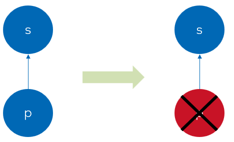

There are two possible options how ``s`` should behave:
* Proceed with execution, since the predecessor task is gone. This makes sense in use cases where the dependency restricts access to a shared resource.
* Wait indefinitely, as it may strictly depend on the result of ``p``.

Another use case to consider is three tasks ``L1``, ``L2`` and ``L3`` connected with each other, and ``L2`` is destroyed:

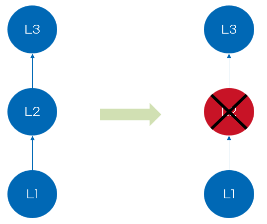

The question is, should ``L1`` completion be guaranteed before ``L3`` proceed for execution?

Since concrete use cases for partial task tree destruction were not considered, and the required behavior
is unknown, the current proposal treats it as undefined behavior.

Moving this feature to `supported` requires defining the semantic for this case.

### ``empty_task`` API

Since successors can only be transferred to a single task, some use cases (see [N-body example](#n-bodies-problem)) 
require creating a synchronization-only empty task to combine multiple end-tasks in a subgraph and transfer successors to it:

```cpp
// N-body rectangle split
tbb::task_handle left_lower_rectangle_task = tg.defer(...);
tbb::task_handle right_upper_rectangle_task = tg.defer(...);
tbb::task_handle left_upper_rectangle_task = tg.defer(...);
tbb::task_handle right_lower_rectangle_task = tg.defer(...);

tbb::task_handle empty_sync_task = tg.defer([] {});

tbb::task_group::set_task_order(left_lower_rectangle_task, left_upper_rectangle_task);
tbb::task_group::set_task_order(left_lower_rectangle_task, right_lower_rectangle_task);
tbb::task_group::set_task_order(right_upper_rectangle_task, left_upper_rectangle_task);
tbb::task_group::set_task_order(right_upper_rectangle_task, right_lower_rectangle_task);

tbb::task_group::set_task_order(left_upper_rectangle_task, empty_sync_task);
tbb::task_group::set_task_order(right_lower_rectangle_task, empty_sync_task);

tbb::task_group::transfer_this_task_completion_to(empty_sync_task);
```

In the current TBB implementation, ``empty_sync_task`` is still spawned or bypassed and executed, potentially introducing unnecessary scheduling overhead.

A possible extension is to add a special API to `task_group` that provides an `empty_task` — a task type that is never scheduled and is skipped once its dependencies are resolved:

```cpp
auto empty_sync_task = tg.get_empty_task();

...

tbb::task_group::set_task_order(left_upper_rectangle_task, empty_sync_task);
tbb::task_group::set_task_order(right_upper_rectangle_task, empty_sync_task);
tbb::task_group::transfer_this_task_completion_to(empty_sync_task);

// empty_sync_task would not be spawned and only used for dependency tracking
```

An alternative approach is to allow ``transfer_this_task_completion_to`` to accept multiple tasks as parameters. The example above would then look like:

```cpp
tbb::task_group::transfer_this_task_completion_to(left_upper_rectangle_task, right_upper_rectangle_task);
```

From an implementation perspective, the same empty synchronization task could still be created internally.

### Transferring successors to the task in any state

The current proposal limits ``transfer_this_task_completion_to`` to only accept a task in the `created` state as the recipient. It is enforced by allowing
only `task_handle` as the argument.

Current use cases do not require transferring successors to tasks in arbitrary state. However, if such a need arises in the future,
the semantics of `transfer_this_task_completion_to` could be extended with a new overload:

```cpp
namespace oneapi {
namespace tbb {

class task_group {
public:
    static void transfer_this_task_completion_to(task_completion_handle& task);
};

} // namespace tbb
} // namespace oneapi
```

From an implementation perspective, this would require merged successor tracking to support not just two tasks (the sender and the recipient), but an entire set of
tasks — since a task may transfer its completion to another task that is also performing `transfer_this_task_completion_to`, and so on.

### Using a ``task_completion_handle`` as a successor

The current proposal restricts successors to tasks in the `created` state. This is enforced by allowing only
a ``task_handle`` as the second argument to ``set_task_order``:

```cpp
namespace oneapi {
namespace tbb {
class task_group {
    static void set_task_order(task_handle& pred, task_handle& succ);
    static void set_task_order(task_completion_handle& pred, task_handle& succ);
};
} // namespace tbb
} // namespace oneapi
```

Two enhancements to this API can be considered:
* Allow a ``task_completion_handle`` that handles a completion of a task in the `created` state to be used as a successor.
* Allow a ``task_completion_handle`` that handles a completion of a task `T` in the `submitted` state to be used as a successor, provided that other
  predecessors of ``T`` - which are not yet submitted or still executing - prevent ``T`` from being scheduled.

These enhancements require the following APIs to be added:

```cpp
namespace oneapi {
namespace tbb {
class task_group {
    static void set_task_order(task_handle& pred, task_completion_handle& succ);
    static void set_task_order(task_completion_handle& pred, task_completion_handle& succ);
};
} // namespace tbb
} // namespace oneapi
```

If a ``task_completion_handle`` referring to a task in the `executing`, or `completed` state is used
as the second argument, the behavior is undefined.

Alternative approach is to define a function that attempts to convert a ``task_completion_handle`` to a valid ``task_handle``, if the task
has not been started yet. The returned ``task_handle`` can be used for adding new predecessors and have to be resubmitted for execution.

### Returning ``task_completion_handle`` from submission functions

It may be useful to allow adding successors not only to tasks represented by ``task_handle``, but also to those
created via submission functions that accept a function object as an argument:

```cpp
tbb::task_group tg;
tbb::task_completion_handle ch = tg.run([] { /*task body*/ });
// ...

tbb::task_handle successor = tg.defer([] { /*successor body*/ });
tbb::task_group::set_task_order(ch, successor);
```

Since changing the return type of ``task_group::run`` to be ``task_completion_handle`` will introduce extra overhead for cases where returned value
is not needed or ignored, this should be achieved by either introducing a new submission function or adding an extra argument to ``task_group::run``:

```cpp
namespace oneapi {
namespace tbb {
class task_group {
    // Option 1 - introduce a new submission function
    template <typename Body>
    tbb::task_completion_handle run_and_get_completion_handle(const Body& body);

    // Option 2 - add overload with an extra argument
    template <typename Body>
    tbb::task_completion_handle run(const Body& body, additional-flag-argument);
};
} // namespace tbb
} // namespace oneapi
```

## Naming considerations

The original APIs introduced by this proposal included:
* The ``task_tracker`` class, representing a task in any of the defined states (`created`, `submitted`, `executing`, or `completed`).
* The ``tbb::task_group::make_edge`` function to establish a predecessor-successor relationship between tasks.
* The ``tbb::task_group::current_task::transfer_successors_to`` function, which moves successors from the currently executing task to another task.

The main concern with the name ``task_tracker`` was that the class does not actually track task progress- it only represents a task for the purpose of adding successors.

``task_completion_handle`` was considered a better alternative, as it reflects its correlation with ``set_task_order`` and
``transfer_this_task_completion_to``, both of which depend on task completion.

To emphasize the semantical difference between ``tbb::task_group::make_edge`` and ``flow::make_edge``, which establishes a permanent edge between graph nodes,
the API was renamed to ``tbb::task_group::set_task_order``.

``tbb::task_group::current_task::transfer_successors_to`` did not clearly describe the extended
[effect of transferring](#semantics-for-transferring-successors-from-the-currently-executing-task-to-the-other-task).

``transfer_this_task_completion_to(t)`` was adopted to emphasize that the successors of the currently executing task will proceed only after
`t` completes. The combination of ``transfer_this_task_completion_to`` and ``task_completion_handle`` indicates that successors
added after the transfer will be associated with the task that receives the completion, and the ``task_completion_handle`` follows the transferred completion of the task.

## Implementation details

Implementation details for the API added by this RFC are described as part of the
[separate sub-RFC](implementation_details.md).

## Exit criteria & open questions
* Performance targets for this feature should be defined.
* API improvements and enhancements should be considered (these may be criteria for promoting the feature to `supported`):
  * Do the current API names clearly reflect the purpose of their corresponding methods?
  * The semantic for partial destruction of the task tree should be defined. See [separate section](#semantics-for-partial-task-tree-destruction) for more details.
  * Should comparison functions between ``task_completion_handle`` and ``task_handle`` be defined?
  * Should a ``task_completion_handle`` referring to a task in the `created` or `submitted` state (but not always) be allowed as a
    successor in ``set_task_order``? See [separate section](#using-a-task_completion_handle-as-a-successor) for more details.
  * Should an ``empty_task`` helper API be provided to optimize the creation and spawning of empty sync-only tasks. See
    [separate section](#empty_task-api) for more details.
  * Should submitting functions that accept a body and return a `task_completion_handle` be introduced? See
    [separate section](#returning-task_completion_handle-from-submission-functions) for further details.

## Advanced examples

This section describes the applicability of the proposal to the advanced scenarios that were not considered as part of the parent RFC.

### Recursive Fibonacci

The Recursive Fibonacci example illustrates parallel computation of the N-th Fibonacci number. Each *N*-th Fibonacci number is computed by calculating the *N-1*-th and 
*N-2*-th numbers in parallel, then summing their results after both computations
complete.

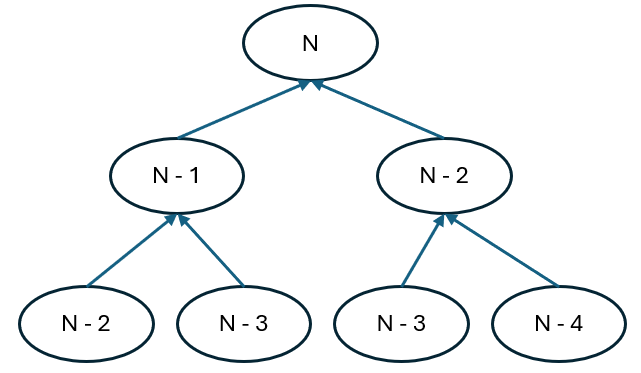

Possible implementation of this example is part of [oneTBB migration examples](https://github.com/uxlfoundation/oneTBB/tree/master/examples/migration).

The example can also be easily implemented using the proposed API. Each task computing the *N*-th Fibonacci number should create two subtasks - `subtask1` and `subtask2` - to compute the *(N-1)*-th and *(N-2)*-th numbers
respectively, and a `merge_sum` task to calculate their sum.

Since `merge_sum` needs to be executed only after the computations of `subtask1` and `subtask2` are completed, there should be a predecessor-successor dependency between `subtask1` and `merge_sum` and
between `subtask2` and `merge_sum`.

To preserve the predecessor-successor relationships in the task graph, the currently executing task should transfer its successors to `merge_sum`, effectively replacing itself in the graph.

```cpp
int serial_fibonacci(int n) {
    if (n == 0 || n == 1) return n;
    return serial_fibonacci(n - 1) + serial_fibonacci(n - 2);
}

constexpr int serial_fibonacci_cutoff = 25;

void recursive_fibonacci_number(tbb::task_group& tg, int n, int* result_placeholder) {
    if (n <= serial_fibonacci_cutoff) {
        *result_placeholder = serial_fibonacci(n);
    } else {
        int* subtask1_placeholder = new int(0);
        int* subtask2_placeholder = new int(0);

        tbb::task_handle subtask1 = tg.defer([&tg, n, subtask1_placeholder] {
            recursive_fibonacci_number(tg, n - 1, subtask1_placeholder);
        });

        tbb::task_handle subtask2 = tg.defer([&tg, n, subtask2_placeholder] {
            recursive_fibonacci_number(tg, n - 2, subtask2_placeholder);
        });

        tbb::task_handle merge_sum = tg.defer([=] {
            *result_placeholder = *subtask1_placeholder + *subtask2_placeholder;
            delete subtask1_placeholder;
            delete subtask2_placeholder;
        });

        tbb::task_group::set_task_order(subtask1, merge_sum);
        tbb::task_group::set_task_order(subtask2, merge_sum);

        tbb::task_group::transfer_this_task_completion_to(merge_sum);

        tg.run(std::move(subtask1));
        tg.run(std::move(subtask2));
        tg.run(std::move(merge_sum));
    }
}

int fibonacci_number(int n) {
    tbb::task_group tg;
    int result = 0;
    tg.run_and_wait([&tg, &result, n] {
        recursive_fibonacci_number(tg, n, &result);
    });
    return result;
}

```

### N-bodies problem

The parallel N-bodies simulation models a set of N planetary bodies drifting in space. The algorithm computes the successive positions of each body
over time. It first computes the gravitational force acting on each body as the sum of forces exerted on it by all of the other bodies, and
adjusts the velocity of each body according to the computed force. 

Since each *i*-th body exerts a force on the *j*-th body equal in magnitude and
opposite in direction to the force exerted by *j*-th body on *i*th, 
the problem can be reduced to traversing the upper triangle of a matrix and
computing the force at each point.

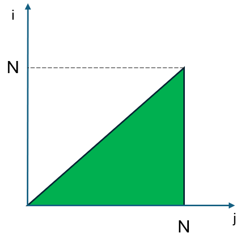

For efficient parallel computation, we can follow the algorithm described in the
[Parallel Programming with Cilk I](https://dspace.mit.edu/bitstream/handle/1721.1/122680/6-172-fall-2010/contents/projects/MIT6_172F10_proj4_1.pdf) paper.

To parallelize the computation on the triangle, the algorithm splits it into two smaller triangles and one rectangle, as shown in the picture below:

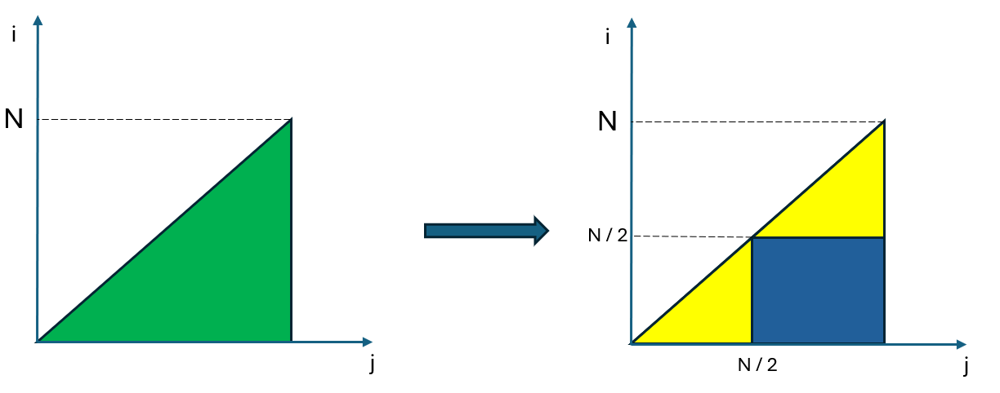

As described in the paper, parallel computations can only be performed on non-intersecting *i* and *j* indices. Therefore, the two yellow triangles can
be processed in parallel, while the blue rectangle must wait until both triangles are completed.

Each sub-triangle can be divided using the same splitting algorithm for triangles.

Computations on the rectangles can also be parallelized by splitting each rectangle as shown in the picture below:

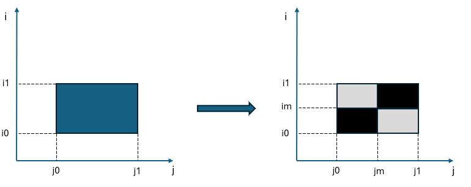

Computations on both the black and gray sub-rectangles can be performed in parallel. 

This problem can also be implemented using the proposed API. Let's first consider the triangle split.
Each task that processes a triangle creates two subtasks - `triangle_subtask1` and `triangle_subtask2` - to
compute the sub-triangles, and a subtask `rectangle_subtask` to handle the sub-rectangle.

As mentioned above, only the sub-triangles can be computed in parallel. Therefore, a predecessor-successor relationship
should be established between each triangle subtask and `rectangle_subtask`
to ensure the rectangle is processed only after the sub-triangles complete.

Each splitting task should replace itself in the task graph with the `rectangle_subtask` by transferring its successors
to it:

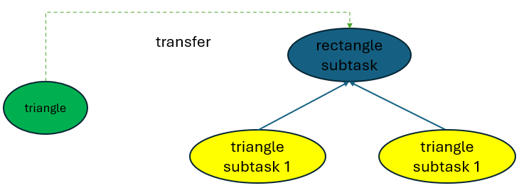

Subtasks that compute the triangle split follow the same logic. 

Each task that processes a rectangle creates two subtasks - `left_lower_subtask` and `right_upper_subtask` - to compute
the black sub-rectangles, and two more - `left_upper_subtask` and `right_lower_subtask` - to
compute the gray sub-rectangles.

To ensure that the black and gray sub-rectangles are not computed in parallel, a predecessor-successor relationship should
be established between each corresponding pair.

Similar to the triangle split, the current task should also replace itself in the task graph with another task that
synchronizes the work. Since the current API only allows transferring successors to a single task, an empty task should be
created as a synchronization point, and the current task's successors should be transferred to this task:

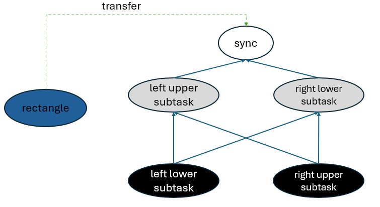

```cpp
class Body;
void calculate_force(double& fx, double& fy, Body& body1, Body& body2);
void add_force(Body* body, double fx, double fy);

constexpr int threshold = 16;

void serial_calculate_and_update_forces(int i0, int i1, int j0, int j1,
                                        Body* bodies)
{
    for (int i = i0; i < i1; ++i) {
        for (int j = j0; j < j1; ++j) {
            // update the force vector on bodies[i] exerted by bodies[j]
            // and, symmetrically, the force vector on bodies[j] exerted
            // by bodies[i]
            if (i == j) continue;

            double fx, fy;
            calculate_force(fx, fy, bodies[i], bodies[j]);
            add_force(&bodies[i], fx, fy);
            add_force(&bodies[i], -fx, -fy);
        }
    }
}

// traverse the rectangle i0 <= i <= i1, j0 <= j <= J1
void n_body_rectangle(tbb::task_group& tg,
                      int i0, int i1, int j0, int j1,
                      Body* bodies)
{
    int di = i1 - i0;
    int dj = j1 - j0;
    if (di <= threshold || dj <= threshold) {
        serial_calculate_and_update_forces(i0, i1, j0, j1, bodies);
    } else {
        int im = i0 + di / 2;
        int jm = j0 + dj / 2;

        tbb::task_handle left_lower_subtask = tg.defer([=, &tg] {
            n_body_rectangle(tg, i0, im, j0, jm, bodies);
        });

        tbb::task_handle right_upper_subtask = tg.defer([=, &tg] {
            n_body_rectangle(tg, im, i1, jm, j1, bodies);
        });

        tbb::task_handle left_upper_subtask = tg.defer([=, &tg] {
            n_body_rectangle(tg, i0, im, jm, j1, bodies);
        });

        tbb::task_handle right_lower_subtask = tg.defer([=, &tg] {
            n_body_rectangle(tg, im, i1, j0, jm, bodies);
        });

        tbb::task_handle sync = tg.defer([] {});

        tbb::task_group::set_task_order(left_lower_subtask, left_upper_subtask);
        tbb::task_group::set_task_order(left_lower_subtask, right_lower_subtask);
        tbb::task_group::set_task_order(right_upper_subtask, left_upper_subtask);
        tbb::task_group::set_task_order(right_upper_subtask, right_lower_subtask);
        
        tbb::task_group::set_task_order(left_upper_subtask, sync);
        tbb::task_group::set_task_order(right_lower_subtask, sync);

        tbb::task_group::transfer_this_task_completion_to(sync);

        tg.run(std::move(left_lower_subtask));
        tg.run(std::move(right_upper_subtask));
        tg.run(std::move(left_upper_subtask));
        tg.run(std::move(right_lower_subtask));
        tg.run(std::move(sync));
    }
}

// traverse the triangle n0 <= i <= j <= n1
void n_body_triangle(tbb::task_group& tg, int n0, int n1, Body* bodies) {
    int dn = n1 - n0;
    // If dn == 1, do nothing since a single body has no
    // interaction with itself
    if (dn != 1) {
        int nm = n0 + dn / 2;
        tbb::task_handle triangle_subtask1 = tg.defer([=, &tg] {
            n_body_triangle(tg, n0, nm, bodies);
        });

        tbb::task_handle triangle_subtask2 = tg.defer([=, &tg] {
            n_body_triangle(tg, nm, n1, bodies);
        });

        tbb::task_handle rectangle_subtask = tg.defer([=, &tg] {
            n_body_rectangle(tg, n0, nm, nm, n1, bodies);
        });

        tbb::task_group::set_task_order(triangle_subtask1, rectangle_subtask);
        tbb::task_group::set_task_order(triangle_subtask2, rectangle_subtask);

        tbb::task_group::transfer_this_task_completion_to(rectangle_subtask);

        tg.run(std::move(triangle_subtask1));
        tg.run(std::move(triangle_subtask2));
        tg.run(std::move(rectangle_subtask));
    }
}

void calculate_forces(int n_bodies, Body* bodies) {
    tbb::task_group tg;
    tg.run_and_wait([&tg, n_bodies, bodies] {
        n_body_triangle(tg, 0, n_bodies, bodies);
    });
}
```

### Wavefront

Wavefront is a scientific programming pattern where data elements are distributed across multidimensional grids and must be computed in a specific order
due to inter-element dependencies.

Consider a two-dimensional wavefront example where computation begins at the top-left corner of the grid:

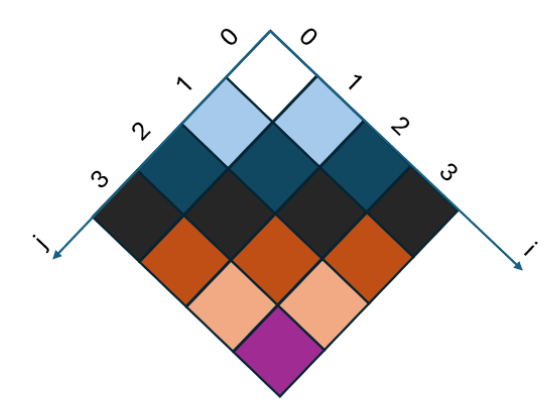

Each element *(i,j)* in the grid can be computed once its two dependent sub-elements are completed:
* Upper right dependency: element *(i, j - 1)* (if present)
* Upper left dependency: element *(i - 1, j)* (if present)

As a result, all antidiagonal elements in the grid can be computed in parallel since they have no dependencies between them (as shown by the same-colored cells in the diagram).

#### Non-recursive approach

The simplest way to implement the wavefront pattern is to create all cell computation tasks and establish their dependencies
before starting execution.

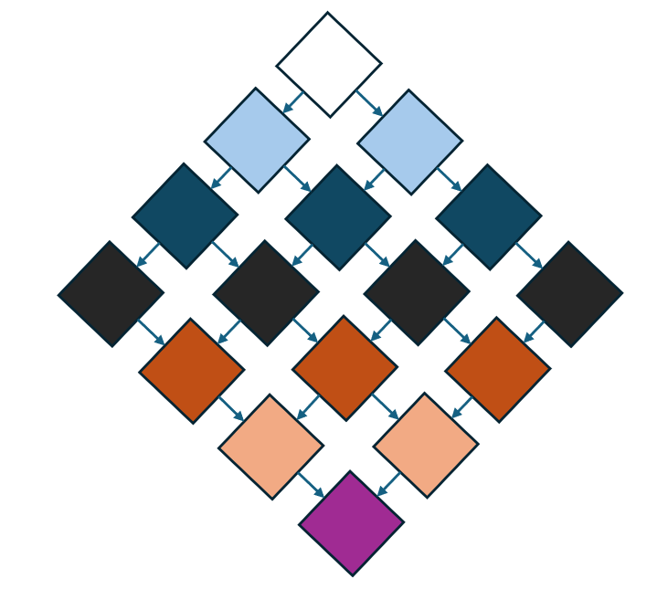

```cpp
void compute_cell(int i, int j);

void non_recursive_wavefront(int in, int jn) {
    tbb::task_group tg;

    std::vector<std::vector<tbb::task_handle>> cell_tasks;

    cell_tasks.reserve(in);

    for (int i = 0; i < in; ++i) {
        cell_tasks[i].reserve(jn);

        for (int j = 0; j < jn; ++j) {
            cell_tasks[i].emplace_back(tg.defer([=] { compute_cell(i, j); }));

            // upper right dependency
            if (j != 0) { tbb::task_group::set_task_order(cell_tasks[i][j - 1], cell_tasks[i][j]); }

            // upper left dependency
            if (i != 0) { tbb::task_group::set_task_order(cell_tasks[i - 1][j], cell_tasks[i][j]); }
        }
    }

    // Run the graph
    for (int i = 0; i < in; ++i) {
        for (int j = 0; j < jn; ++j) {
            tg.run(std::move(cell_tasks[i][j]));
        }
    }
    tg.wait();
}
```

#### Classic recursive approach

An alternative approach is to implement the wavefront pattern using a divide-and-conquer strategy with recursive grid splitting.

In this case, the initial task splits the grid into four subtasks, each of which recursively splits its sub-area into four more subtasks, and so on:

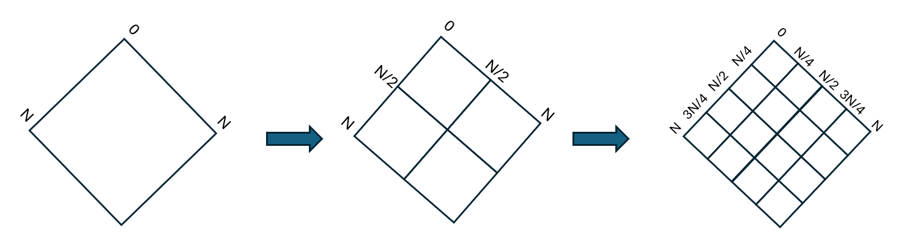

In the classic recursive approach, each task creates four subtasks -  `north_subtask`, `west_subtask`, `east_subtask` and `south_subtask` - and
sets the following predecessor-successor relationships:
* `north_subtask` -> `west_subtask`,
* `north_subtask` -> `east_subtask`,
* `west_subtask` -> `south_subtask`,
* `east_subtask` -> `south_subtask`.

To maintain the task graph structure, the currently executing task should replace itself with `south_subtask` by transferring its successors.

```cpp
void compute_cell(int i, int j);

void serial_wavefront(int i0, int in, int j0, int jn) {
    for (int i = i0; i < in; ++i) {
        for (int j = j0; j < jn; ++j) {
            compute_cell(i, j);
        }
    }
}

constexpr int threshold = 4;

void classic_recursive_wavefront_task(tbb::task_group& tg, int i0, int in, int j0, int jn) {
    int di = in - i0;
    int dj = jn - j0;

    if (di <= threshold || dj <= threshold) {
        serial_wavefront(i0, in, j0, jn);
    } else {
        int im = i0 + di / 2;
        int jm = j0 + dj / 2;

        tbb::task_handle north_subtask = tg.defer([=, &tg] {
            classic_recursive_wavefront_task(tg, i0, im, j0, jm);
        });

        tbb::task_handle west_subtask = tg.defer([=, &tg] {
            classic_recursive_wavefront_task(tg, i0, im, jm, jn);
        });

        tbb::task_handle east_subtask = tg.defer([=, &tg] {
            classic_recursive_wavefront_task(tg, im, in, j0, jn);
        });

        tbb::task_handle south_subtask = tg.defer([=, &tg] {
            classic_recursive_wavefront_task(tg, im, in, jm, jn);
        });

        tbb::task_group::set_task_order(north_subtask, west_subtask);
        tbb::task_group::set_task_order(north_subtask, east_subtask);
        tbb::task_group::set_task_order(west_subtask, south_subtask);
        tbb::task_group::set_task_order(east_subtask, south_subtask);

        tbb::task_group::transfer_this_task_completion_to(south_subtask);

        tg.run(std::move(north_subtask));
        tg.run(std::move(west_subtask));
        tg.run(std::move(east_subtask));
        tg.run(std::move(south_subtask));
    }
}

void classic_recursive_wavefront(int in, int jn) {
    tbb::task_group tg;
    tg.run_and_wait([=, &tg] {
        classic_recursive_wavefront_task(tg, 0, in, 0, jn);
    });
}
```

The task graph for the classic recursive approach is shown in the diagram below:

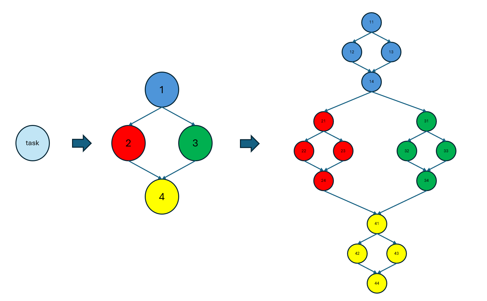

#### Eager recursive approach

The main downside of the classic approach is that it introduces extra dependencies between tasks that do not actually depend on each other.

For example, in the task graph above, the task `21` starts executing only after the task `14` completes, logically it depends only
on task `12` and should not have to wait for `14`.

An improved approach, known as eager recursion, is described in the [Cache-Oblivious Wavefront](https://people.csail.mit.edu/yuantang/Docs/PPoPP15-yuantang.pdf) paper.

In this recursion model, each dividing task anticipates that its dependent
tasks will also split, and notifies them of the necessary subtasks to establish
only the true dependencies.

Let's consider wavefront computation on a square grid over the ``x`` and ``y``
dimensions, ranging from ``[0, n)``.

Similar to the classic algorithm, the eager version splits the area into four subregions by creating four
subtasks: ``north_subtask``, ``west_subtask``, ``east_subtask`` and ``south_subtask``.

The algorithm  also establishes the same dependencies as the classic approach:
* ``west_subtask`` and ``east_subtask`` are dependent on ``north_subtask``
* ``south_subtask`` depends on both ``west_subtask`` and ``east_subtask``.

During the first division, no additional actions are needed, since the task that splits the entire grid ``[0,n)`` has no successors.

However, during the second division - when the north, west, east and south subtasks are executed,
each task must notify its successors about the subtasks to establish dependencies.

Let's examine the second division in detail. Initially, we have four subtasks created during the first division:

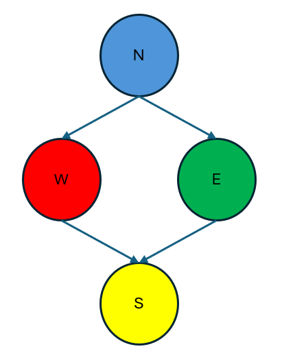

The north subtask executes first because west, east and south subtasks cannot be
executed because of their dependencies.
As in the previous step, it creates the north, east, west and south subtasks:

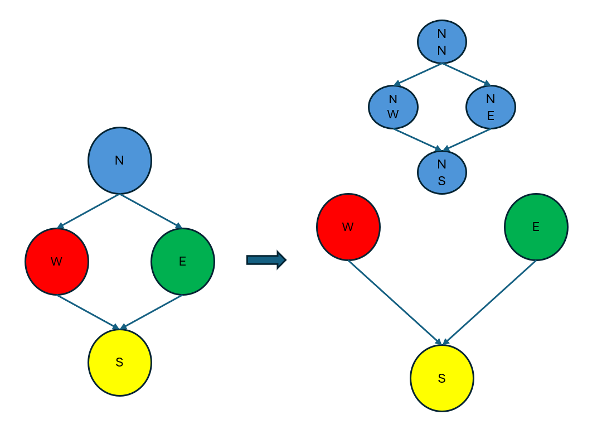

The next step is to notify each successor about its relevant subtasks:
* ``W`` should be notified about the ``NW`` and ``NS`` subtasks,
* ``E`` should be notified about the ``NE`` and ``NS`` subtasks.

Successors are notified by creating ``task_completion_handle`` objects that handles the completion of the corresponding subtasks and storing them
in a shared container accessible to the successors.

The ``NN`` subtask can begin execution and further subdivision once the previous
level's split is complete and its successors have been notified.

Once the ``N`` task completes, the ``W`` and ``E`` subtasks are free to begin execution. The ``W`` subtask also splits into subtasks and
notifies ``S`` of its successors:

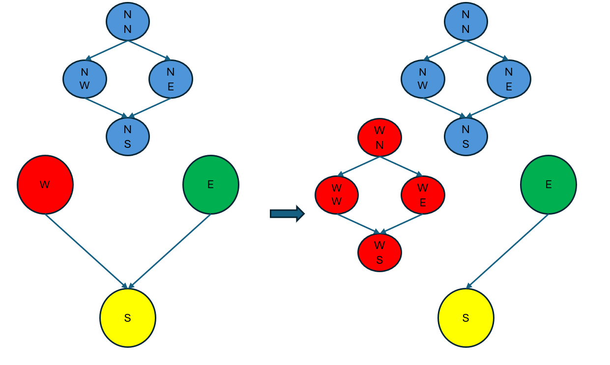

Additionally, ``W`` should add dependencies between its subtasks ``WN`` and ``WE`` and the subtasks of ``N`` created
in the previous step (``NW`` and ``NS``):

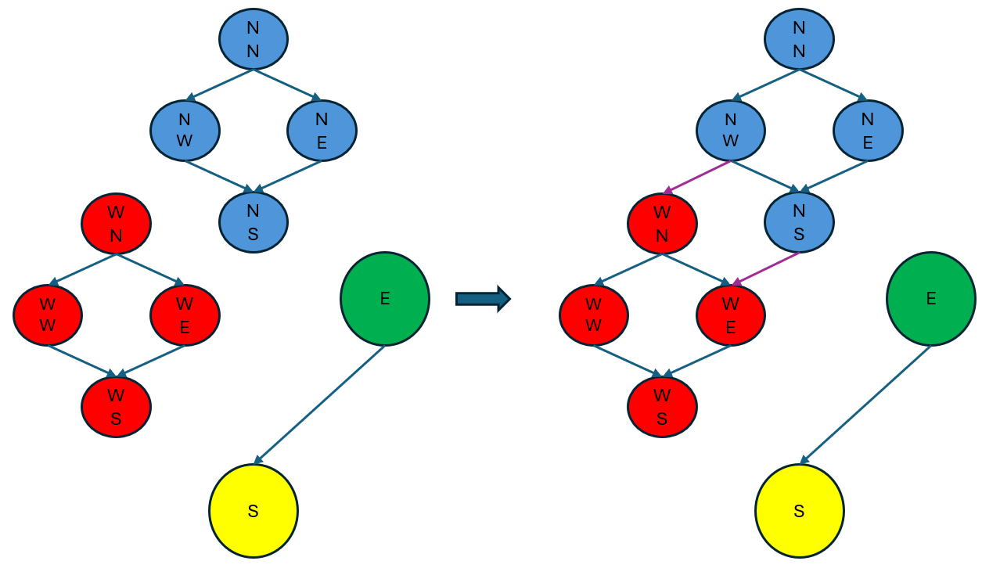

It is important to note that when these additional dependencies are established, ``NW`` and ``NS`` are already in the
`submitted` state, and may even have completed.

This highlights the importance of being able to use tasks in any state as predecessors in ``set_task_order``.

The ``E`` and ``S`` subtasks follow the same logic as described above. This results in the following task graph structure:

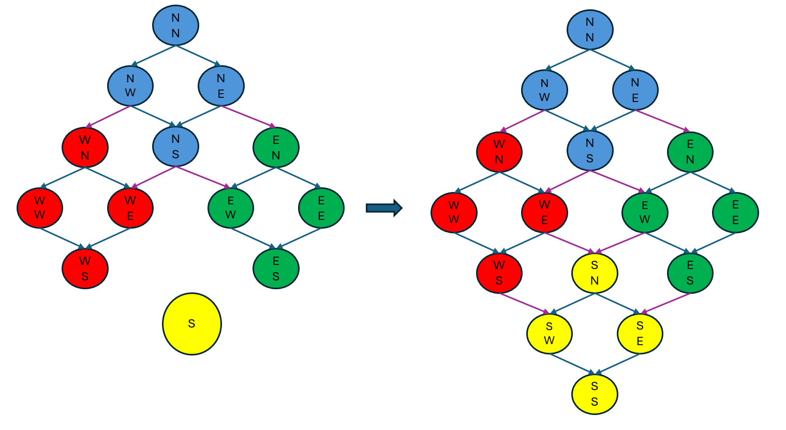

This recursive splitting continues until the desired depth is reached.

The following code demonstrates how this approach can be implemented using the proposed API:

```cpp
void compute_cell(std::size_t x, std::size_t y);

void serial_wavefront(std::size_t x0, std::size_t xn, std::size_t y0, std::size_t yn) {
    for (std::size_t x = x0; x < xn; ++x) {
        for (std::size_t y = y0; y < yn; ++y) {
            compute_cell(x, y);
        }
    }
}

class eager_wavefront_task {
public:
    static void prepare_predecessors_container(std::size_t num_divisions) {
        if (num_divisions > 1) {
            // Reserve space in the container for each level of recursive division
            predecessors.resize(num_divisions + 1);
            int num_subtasks = 4; // number of subtasks on the first level

            // First division cannot have predecessors, start filling the container from the second item
            for (std::size_t i = 1; i < num_divisions; ++i) {
                predecessors[i].reserve(num_subtasks);
                num_subtasks *= 4;
            }
        }
    }

    static std::size_t grid_dimension_size(std::size_t n_division) {
        // Number of elements in each dimension of the grid on the current level of division
        // On the first level - 4 subtasks total (2 items on each dimension)
        // on the second level - 16 subtasks total (4 items on each dimension), etc.
        return (1 << n_division);
    }

    static tbb::task_completion_handle find_predecessor(std::size_t n_division, std::size_t x_index, std::size_t y_index) {
        assert(n_division != 0); // 0th level of division cannot have predecessors

        auto it = predecessors[n_division].find(x_index * grid_dimension_size(n_division) + y_index);
        assert(it != predecessors[n_division].end());
        return it->second;
    }

    static void publish_predecessor(std::size_t n_division, std::size_t x_index, std::size_t y_index,
                                    tbb::task_completion_handle&& pred)
    {
        assert(n_division != 0); // 0th division should not publish predecessors

        [[maybe_unused]] auto p = predecessors[n_division].emplace(x_index * grid_dimension_size(n_division) + y_index,
                                                                   std::move(pred));
        assert(p.second);
    }

    eager_wavefront_task(tbb::task_group& tg, std::size_t x_index, std::size_t y_index,
                         std::size_t x0, std::size_t xn, std::size_t y0, std::size_t yn,
                         std::size_t n_div)
        : m_tg(tg), m_x_index(x_index), m_y_index(y_index)
        , m_x0(x0), m_xn(xn), m_y0(y0), m_yn(yn)
        , m_n_division(n_div)
    {}

    void operator()() const {
        std::size_t x_size = m_xn - m_x0;
        std::size_t y_size = m_yn - m_y0;

        // Do serial wavefront if the grainsize reached
        if (x_size <= wavefront_grainsize) {
            assert(y_size <= wavefront_grainsize);
            serial_wavefront(m_x0, m_xn, m_y0, m_yn);
        } else {
            std::size_t x_mid = m_x0 + x_size / 2;
            std::size_t y_mid = m_y0 + y_size / 2;

            // Calculate indices of subtasks in the next level grid
            std::size_t north_x_index = m_x0 / (x_mid - m_x0);
            std::size_t north_y_index = m_y0 / (y_mid - m_y0);

            std::size_t west_x_index = north_x_index;
            std::size_t west_y_index = north_y_index + 1;

            std::size_t east_x_index = north_x_index + 1;
            std::size_t east_y_index = north_y_index;

            std::size_t south_x_index = east_x_index;
            std::size_t south_y_index = west_y_index;

            // Create subtasks
            tbb::task_handle north_subtask = m_tg.defer(eager_wavefront_task(m_tg,
                /*indices in the next level grid = */north_x_index, north_y_index,
                /*area to process = */m_x0, x_mid, m_y0, y_mid,
                /*n_division = */m_n_division + 1));

            tbb::task_handle west_subtask = m_tg.defer(eager_wavefront_task(m_tg,
                /*indices in the next level grid = */west_x_index, west_y_index,
                /*area to process = */m_x0, x_mid, y_mid, m_yn,
                /*n_division = */m_n_division + 1));

            tbb::task_handle east_subtask = m_tg.defer(eager_wavefront_task(m_tg,
                /*indices in the next level grid = */east_x_index, east_y_index,
                /*area to process = */x_mid, m_xn, m_y0, y_mid,
                /*n_division = */m_n_division + 1));

            tbb::task_handle south_subtask = m_tg.defer(eager_wavefront_task(m_tg,
                /*indices in the next level grid = */south_x_index, south_y_index,
                /*area to process = */x_mid, m_xn, y_mid, m_yn,
                /*n_division = */m_n_division + 1));

            // Make dependencies between subtasks
            tbb::task_group::set_task_order(north_subtask, west_subtask);
            tbb::task_group::set_task_order(north_subtask, east_subtask);
            tbb::task_group::set_task_order(west_subtask, south_subtask);
            tbb::task_group::set_task_order(east_subtask, south_subtask);

            // Add extra dependencies with predecessor's subtasks
            // Tasks on 0th division cannot have additional predecessors
            if (m_n_division != 0) {
                if (north_x_index != 0) {
                    auto west_predecessor_east_subtask = find_predecessor(m_n_division + 1, north_x_index - 1, north_y_index);
                    tbb::task_group::set_task_order(west_predecessor_east_subtask, north_subtask);
                }
                if (west_x_index != 0) {
                    auto west_predecessor_south_subtask = find_predecessor(m_n_division + 1, west_x_index - 1, west_y_index);
                    tbb::task_group::set_task_order(west_predecessor_south_subtask, west_subtask);
                }
                if (north_y_index != 0) {
                    auto north_predecessor_west_subtask = find_predecessor(m_n_division + 1, north_x_index, north_y_index - 1);
                    tbb::task_group::set_task_order(north_predecessor_west_subtask, north_subtask);
                }
                if (east_y_index != 0) {
                    auto north_predecessor_south_subtask = find_predecessor(m_n_division + 1, east_x_index, east_y_index - 1);
                    tbb::task_group::set_task_order(north_predecessor_south_subtask, east_subtask);
                }
            }

            // Save completion handles to subtasks for further publishing
            tbb::task_completion_handle north_subtask_ch = north_subtask;
            tbb::task_completion_handle west_subtask_ch = west_subtask;
            tbb::task_completion_handle east_subtask_ch = east_subtask;
            tbb::task_completion_handle south_subtask_ch = south_subtask;

            // Run subtasks
            m_tg.run(std::move(north_subtask));
            m_tg.run(std::move(west_subtask));
            m_tg.run(std::move(east_subtask));
            m_tg.run(std::move(south_subtask));

            // Publish subtasks for successors
            publish_predecessor(m_n_division + 1, north_x_index, north_y_index, std::move(north_subtask_ch));
            publish_predecessor(m_n_division + 1, west_x_index, west_y_index, std::move(west_subtask_ch));
            publish_predecessor(m_n_division + 1, east_x_index, east_y_index, std::move(east_subtask_ch));
            publish_predecessor(m_n_division + 1, south_x_index, south_y_index, std::move(south_subtask_ch));
        }
    }

    static constexpr std::size_t wavefront_grainsize = 5;
private:

    // Each element e[i] in the vector represents a map of additional predecessors on the i-th level of division
    // Each element in the hash table maps linearized index in the grid (x_index * n + y_index) with the
    // completion_handle to the corresponding task
    using predecessors_container_type = std::vector<std::unordered_map<std::size_t, tbb::task_completion_handle>>;

    static predecessors_container_type predecessors;

    tbb::task_group& m_tg;

    // Indices in the grid of current level of division
    // On the first division level indices are [0, 2) on x and y
    // On the second division level indices are [0, 4) on x and y, etc.
    std::size_t m_x_index;
    std::size_t m_y_index;

    // Begin and end indices of the globally computed area
    std::size_t m_x0;
    std::size_t m_xn;
    std::size_t m_y0;
    std::size_t m_yn;

    // Division number
    std::size_t m_n_division;
}; // class eager_wavefront_task

eager_wavefront_task::predecessors_container_type eager_wavefront_task::predecessors;

void eager_wavefront(std::size_t n) {
    tbb::task_group tg;

    std::size_t num_divisions = log2(n / eager_wavefront_task::wavefront_grainsize) + 1;
    eager_wavefront_task::prepare_predecessors_container(num_divisions);

    tg.run_and_wait(eager_wavefront_task(tg,
        /*x_index = */0, /*y_index = */0,
        /*area to process = */0, n, 0, n,
        /*n_division = */0));
}
```

#### Combination of eager and classic approaches

Consider a combination of two approaches described above:
1. Eager splitting at the first and second levels
2. Classic splitting for each subtask created during the second level

The resulting split strategy is illustrated in the diagram below:

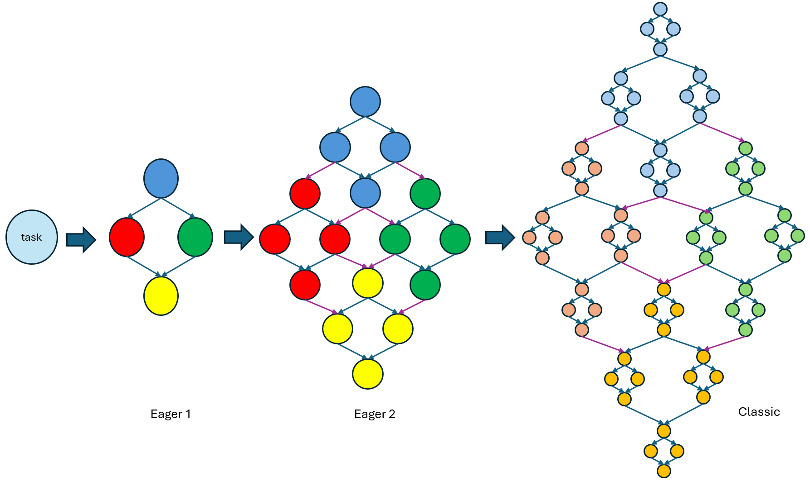

As described in the eager wavefront section above, during the "Eager 2" stage, dependencies between
the blue and red subtasks are created using `task_completion_handle` objects that reference the blue subtasks. The blue subtasks may already be executing 
when these dependencies are established (as shown by purple arrows in the diagram).

During the classic split, each "Eager 2" subtask replaces itself in the task graph with the corresponding south subtask by
transferring its successors.

Because the red subtasks in "Eager 2" only have access to a ``task_completion_handle``
referencing the original blue subtasks (before the transfer), and because
the blue subtasks may already be executing before the dependency between them and
the red subtasks is established, a red subtask may still use a ``task_completion_handle``
referencing the original blue task even after it has replaced itself in
the graph with the "Classic" subtask by transferring its completion.

Therefore, to correctly establish a dependency at the "Eager 2" level, all successors added to a ``task_completion_handle`` associated
with a task that has transferred its completion must be applied to the task that received those successors.
To support this behavior, the "merged successors tracking" approach - described in the
[section above](#semantics-for-transferring-successors-from-the-currently-executing-task-to-the-other-task) -
must be implemented.

### File Parser

The File Parser example emulates an XML or C++ header parser. Consider a set of files *file1...fileN*,
where each file may include one or more other files from the set. We assume that include paths are acyclic (i.e. they do not contain loops).

Parsing begins with file *fileN*.

Each file is processed in two distinct stages:
* *Parsing* the file - involves opening the file, reading its contents, identifying included files, and initiating their processing
* *Finalizing* the file - involves writing the processing result to the output file and performing any finalization steps

Consider the following example:

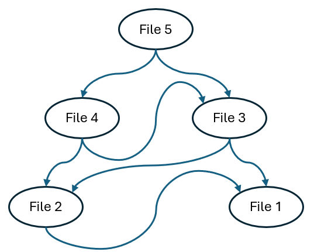

Parsing begins with *File 5*. The arrows indicate which files are included by each file.

A serial implementation of the example is shown below:

```cpp
struct FileInfo {
    using map_type = std::unordered_map<std::string, FileInfo*>;
    static map_type fileMap;
    
    FileInfo(std::string name) : m_name(name) {}

    std::string m_name;
    std::vector<std::string> m_includes;

    void read();
    void write();

    FileInfo* try_process() {
        auto [it, b] = fileMap.emplace(m_name, this);
        if (b) process();
        return it->second;
    }

    void process() {
        parse();
        finalize();
    }

    void parse() {
        read(); // fills m_includes
        for (auto& i : m_includes) {
            FileInfo* maybe = new FileInfo(i);
            FileInfo* actual = maybe->try_process();

            // i was parsed previously
            if (maybe != actual) delete maybe;
        }
    }

    void finalize() { write(); }
};

int main() {
    FileInfo* info = new FileInfo("File 5");
    info->try_process();
    delete info;
}
```

The `FileInfo` class represents the processing logic for each file in the system. `fileMap` is a shared hash map that associates each
file name with its corresponding `FileInfo` instance.

The fields `m_name` and `m_includes` store the file's name and its list of includes, respectively. 

The `read()` function opens the file, reads its content, identifies the included files, and populates the `m_includes` vector.

The `write()` function opens the output file and writes the final processing results to it.

The `try_process()` method attempts to insert the current `FileInfo` into the shared map. If the insertion succeeds, it proceeds to process the file.
Otherwise, the file has already processed, and the function returns the existing `FileInfo` from the shared map.

Since the implementation is serial, the `process()` function performs both the `parse()` and `finalize()` stages sequentially.

The `parse()` stage reads the file, traverses the list of includes, and processes each included file.

The code below shows how the implementation can be modified to be parallel using the proposed API:

```cpp
struct FileInfo {
    using map_type = tbb::concurrent_unordered_map<std::string, FileInfo*>;
    static map_type fileMap;

    std::string              m_name;
    std::vector<std::string> m_includes;

    tbb::task_group&  m_tg;
    tbb::task_handle  m_parse_task;
    tbb::task_completion_handle m_task_completion_handle;

    FileInfo(std::string n, tbb::task_group& tg)
        : m_name(n), m_tg(tg)
    {
        m_task_completion_handle = m_parse_task = m_tg.defer([this] { parse(); });
    }

    void read();
    void write();

    FileInfo* try_process() {
        auto [it, b] = fileMap.emplace(m_name, this);
        if (b) process();
        return it->second;
    }

    void process() {
        m_tg.run(std::move(m_parse_task));
    }

    void parse() {
        read();

        tbb::task_handle finalize_task = m_tg.defer([this] { finalize(); });

        for (auto& i : m_includes) {
            FileInfo* maybe = new FileInfo(i);
            FileInfo* actual = maybe->try_process(); // runs parse task for include

            tbb::task_group::set_task_order(actual->m_task_completion_handle, finalize_task);
            
            // i was parsed previously
            if (maybe != actual) delete maybe;
        }

        tbb::task_group::transfer_this_task_completion_to(finalize_task);
        m_tg.run(std::move(finalize_task));
    }

    void finalize() { write(); }
};

int main() {
    tbb::task_group tg;
    FileInfo* info = new FileInfo("File 5", tg);
    info->try_process();
    tg.wait();
    delete info;
}
```

The `map_type` is changed to a `concurrent_unordered_map` to support thread-safe insertion and lookup of `FileInfo` instances during
parallel processing. 

Each `FileInfo` holds a reference to the `task_group`, a `task_handle` that owns the parsing task, and a `task_completion_handle` initially set
to handle the completion of that task.

The `process()` function submits the task held by `m_parse_task` for execution.

The `parse()` function reads the file, creates a finalization task, transfers the list of dependencies, and establishes a dependency between the
corresponding `task_completion_handle` and the finalization task.

After establishing all dependencies, the parsing task replaces itself in the task graph with `finalize_task` by
calling `transfer_this_task_completion_to(finalize_task)`.

Since `maybe->try_process()` triggers execution of the parsing task, the task may be in one of the following states - `submitted`, `executing`, or
`completed` - at the time the dependency is established.

The parsing task may also transfer its successors to the finalization task. Therefore, `set_task_order` must add the successor to the finalize task, 
demonstrating the need for merged successors tracking - since `m_tracker` was originally set to handle the completion of the parsing task.

Let's examine the tasks and dependencies involved in parsing *File 5*, as illustrated in the diagram above.

Processing *File 5* creates a finalize task `f5f` and two parsing tasks - `f4p` and `f3p` - for each included file.

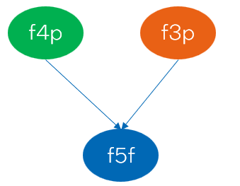

`f4p` and `f3p` are in at least the `submitted` state when the dependency to `f5f` is established.

Let's assume that the task `f3p` is executed next. It creates the finalize task `f3f` and two tasks for the included files - `f2p` and `f1p`:

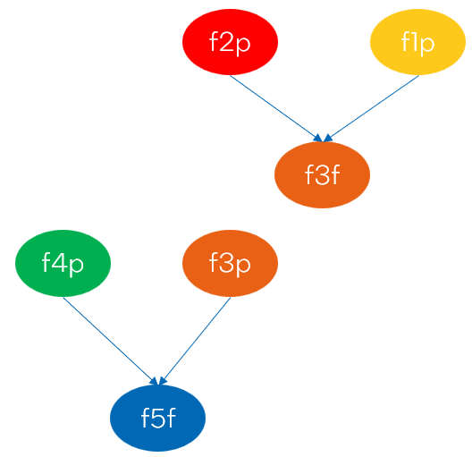

After the dependencies between the included files and `f3f` are established, `f3p` transfers its completion to `f3f` and is destroyed:


Assume that `f4p` is the next task to be executed. It creates the finalize task `f4f` and dependencies to *File 3* and *File 2*.

The task for *File 2* was already created during the parsing of *File 3*, so the completion handle for `f2p` would be found in the `fileMap`. 

The completion handle for *File 3* in the `fileMap` was initially set to handle the completion of `f3p`, but it has already transferred its successors to `f3f`,
making `f3f` the effective target for new dependencies.
Therefore, new dependencies need to be added to `f3f` using the completion handle to `f3p`:

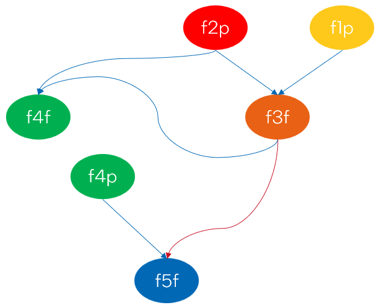

Similar to `f3p`, `f4p` transfers its successor `f5f` to the finalize task `f4f`:

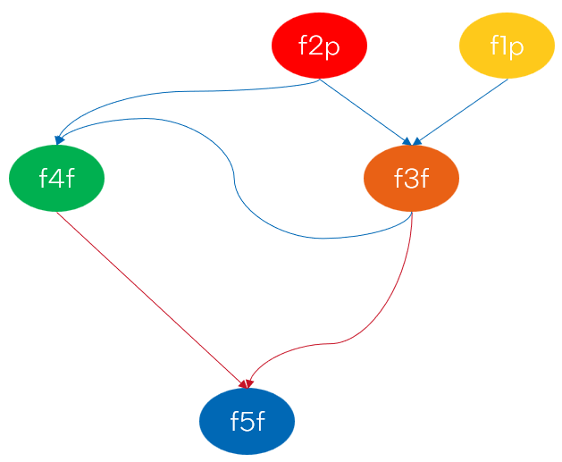

When `f2p` is executed, it creates the finalize task `f2f`, connects it to `f1p`, and transfers its successors to `f2f`:

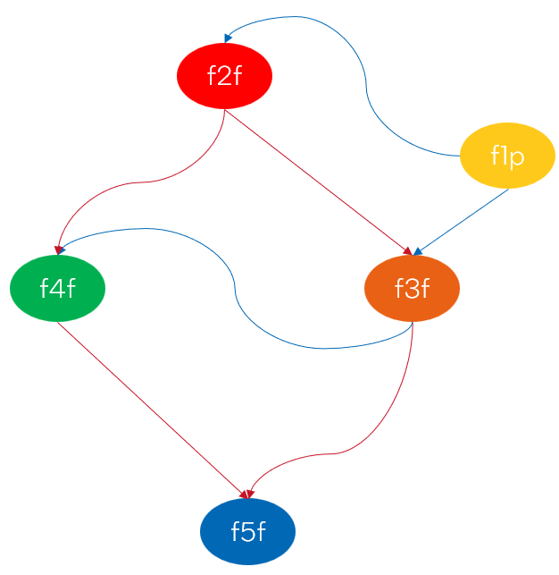

The last task to be executed is `f1p`, which simply replaces itself with the finalize task since there are no dependencies:

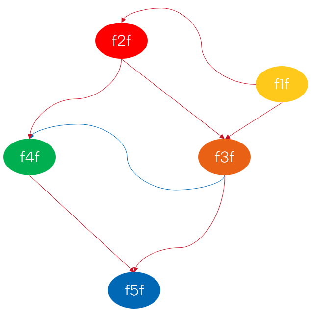

After all of the dependencies are established, *File 1* is finalized, followed by *File 2*, *File 3*, *File 4*, and *File 5*
