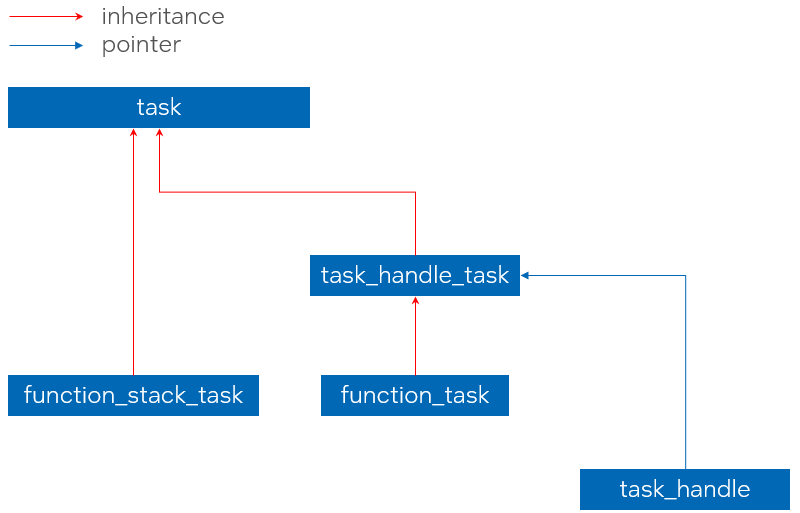
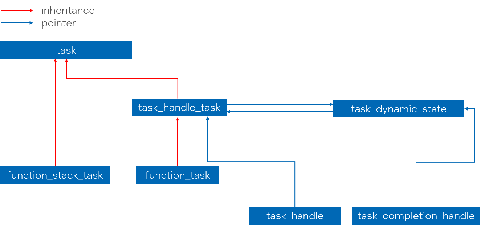
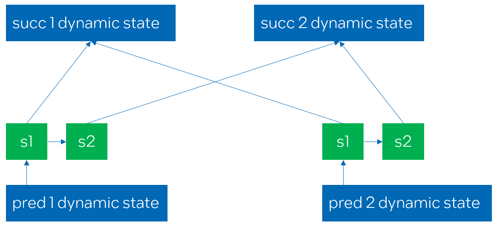
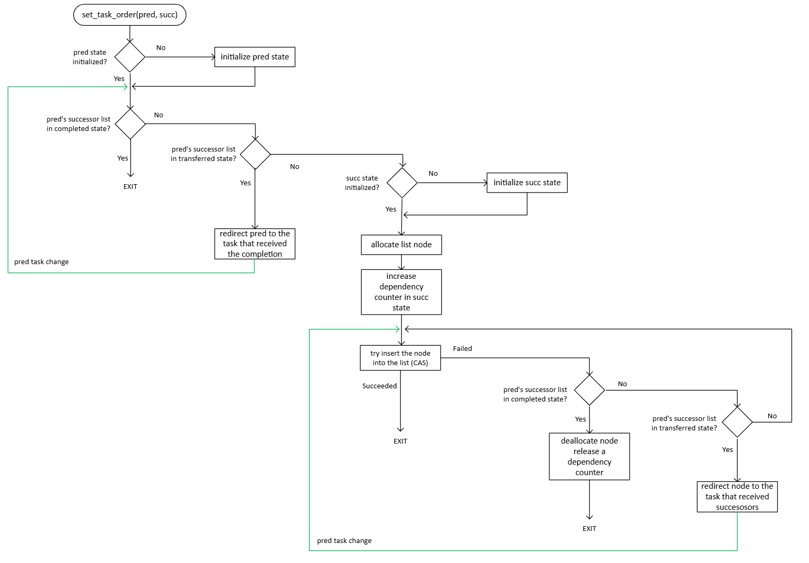
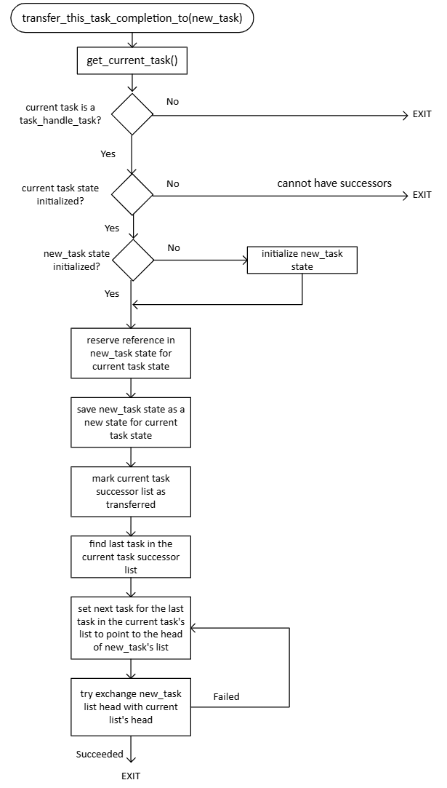
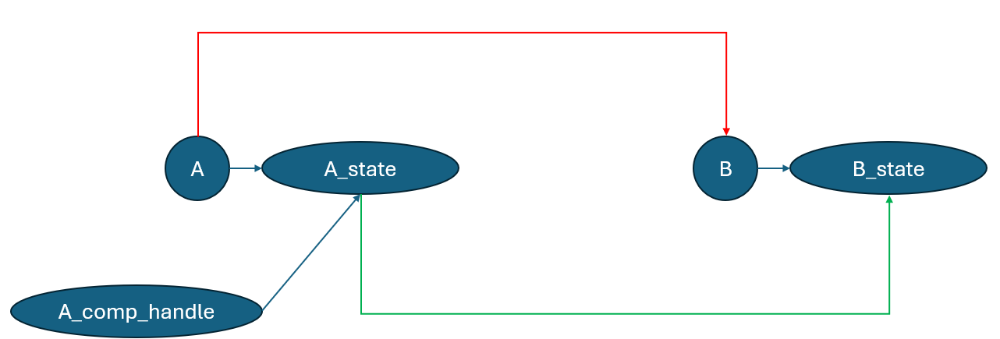
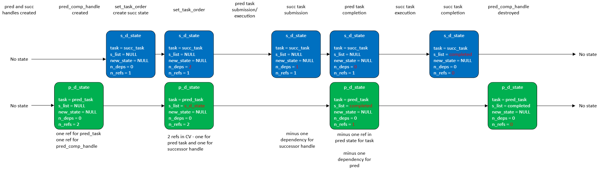
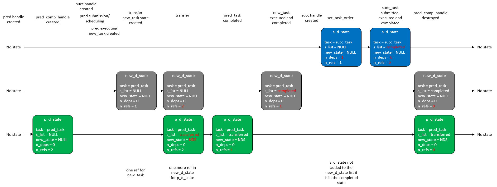
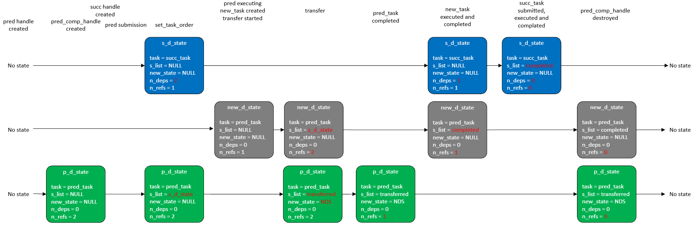

# Implementation Details for the Task Group Dynamic Dependencies Feature

*Note:* This document outlines the implementation details of the [Task Group Dynamic Dependencies RFC](extended_semantics.md)

## Table of contents

* 1 [Class hierarchy before implementing the proposal](#class-hierarchy-before-implementing-the-proposal)
* 2 [`task_dynamic_state` class](#task_dynamic_state-class)
* 3 [Changes in `task_handle_task` class layout](#changes-in-task_handle_task-layout)
* 4 [``tbb::task_completion_handle`` class implementation](#tbbtask_completion_handle-class-implementation)
* 5 [`task_dynamic_state` in details](#task_dynamic_state-in-details)
* 6 [Create dependencies between tasks](#create-dependencies-between-tasks)
  * 6.1 [Tracking the number of dependencies](#tracking-the-number-of-dependencies)
  * 6.2 [The successor list](#the-successor-list)
  * 6.3 [Adding successors to the list](#adding-successors-to-the-list)
  * 6.4 [Notifying the successors](#notifying-the-successors)
  * 6.5 [Submitting a task for execution](#submitting-a-task-for-execution)
* 7 [Transferring completion to the other task](#transferring-completion-to-the-other-task)
  * 7.1 [Dynamic state lifetime issue](#dynamic-state-lifetime-issue)
* 8 [Library ABI changes](#library-abi-changes)
* 9 [Open questions to the implementation](#open-questions-to-the-implementation)
* 10 [Dynamic state transition examples](#dynamic-state-transition-examples)
  * 10.1 [Ordering the tasks](#ordering-the-tasks)
  * 10.2 [Transferring and ordering](#transferring-and-ordering)
    * 10.2.1 [Linearization 1](#linearization-1)
    * 10.2.2 [Linearization 2](#linearization-2)

## Class hierarchy before implementing the proposal

Currently, the `task_group` uses two types of tasks: `function_task` and `function_stack_task`.
A `function_task` is created when non-blocking submission functions or `task_group::defer` are used.
A `function_stack_task` is created only when `task_group::run_and_wait` is used.

The key difference between these task types is that `function_task` copies the body,
whereas `function_stack_task` holds a reference to the user-provided body instance, since
it cannot be destroyed before the blocking API completes.

Due to API limitations, only `function_task` instances can be owned by a `task_handle`.

The `function_task` class inherits from `task_handle_task`, which manages the task's lifetime.
Both `task_handle_task` and `function_stack_task` inherit from the basic `task` class.

The `task_handle` class is implemented as a `unique_ptr` that owns a `task_handle_task` instance.

The class layout is illustrated in the picture below:



## `task_dynamic_state` class

The core components of the APIs described in the [parent RFC](extended_semantics.md) are implemented in the new
`task_dynamic_state` class. This class manages the task status (in progress, completed, transferred), maintains the list
of successors, and handles linkage to a new task during a transfer.

Its layout is described in detail in later sections.

Every task in the task group that has predecessors or successors has an associated `task_dynamic_state` instance.

Since the `set_task_order` API allows completed tasks to act as predecessors, the lifetime of the associated `task_dynamic_state`
instance must extend beyond task completion - until the last `tbb::task_completion_handle` referencing the task is destroyed.

## Changes in `task_handle_task` class layout

To associate a `task_dynamic_state` instance with a task, the current implementation introduces a new atomic pointer field
in the `task_handle_task` class. 

To avoid unnecessary overhead for applications that do not use the dynamic dependencies feature,
the pointer is initially set to `nullptr`, indicating that no dynamic state is associated with the task.

The updated class hierarchy is illustrated in the diagram below:



The `get_dynamic_state()` function performs lazy initialization of the associated state upon its first invocation.
This function is called in the following cases:
* When a `task_completion_handle` is constructed or assigned from a `task_handle` that owns the task,
* When `set_task_order(pred, succ)` is called to establish a predecessor-successor dependency. Dynamic states
  are created for the `task_handle` arguments.
* When `transfer_this_task_completion_to(new_task)` is called from the running task. A dynamic state is created for `new_task`.

If the dynamic state has already been initialized, `get_dynamic_state` simply returns it.

If multiple threads concurrently perform the above actions on the same task instance (e.g. adding
successors to the same predecessor before its dynamic state is created), each thread allocates a new dynamic state object.
It then uses an atomic CAS to update the pointer in `task_handle_task` with the address of that object. If the CAS fails, meaning that
another thread has already stored a dynamic state, the state allocated by the current thread is destroyed.

The `task_dynamic_state` object is initialized with the reference count of 1 to prolong its lifetime
while the task is in progress. When the task is destroyed, the reference counter is decremented.

## `tbb::task_completion_handle` class implementation

The `tbb::task_completion_handle` class represents a task for the purpose of creating task dependencies. It can be constructed or assigned from a
`task_handle`, and is both copyable and movable, with all copies referring to the same `task_dynamic_state` instance.

The dynamic state of a task remains valid until the task itself and all associated `task_completion_handle` instances are destroyed.

A default-constructed `tbb::task_completion_handle` does not represent any task.

From the implementation perspective, `task_completion_handle` behaves like a shared pointer to `task_dynamic_state`, with each copy incrementing the
reference counter of the dynamic state.

It is not currently implemented as a wrapper around `std::shared_ptr<task_dynamic_state>`, because `task_handle_task` and `task_dynamic_state` contain
atomic pointers to `task_dynamic_state`, and `std::atomic<std::shared_ptr>` is a C++20 extension.

## `task_dynamic_state` in details

As previously mentioned, the `task_dynamic_state` class tracks a task's state (completed or not),
its list of successors, and transfers. It has the following layout:

```cpp
class task_dynamic_state {
private:
    task_handle_task*                  m_task;
    std::atomic<successor_list_node*>  m_successor_list_head;
    std::atomic<task_dynamic_state*>   m_new_dynamic_state;
    std::atomic<std::size_t>           m_num_dependencies;
    std::atomic<std::size_t>           m_num_references;
    small_object_allocator             m_allocator;
};
```

`m_task` points to the task that this dynamic state is associated with.

`m_successor_list_head` points to the head of the associated successor list and also serves as a marker for task completion or transferring.

`m_new_dynamic_state` points to another dynamic state instance and is used when the associated task calls
`transfer_this_task_completion_to(new_task)` during execution. After the transfer, it points to the dynamic state of `new_task`.

`m_num_dependencies` tracks how many dependencies must complete before `m_task` can be scheduled for execution.
Further details on `m_successor_list_head`, `m_new_dynamic_state` and `m_num_dependencies` are provided in later sections.

`m_num_references` and `m_allocator` are responsible for managing the lifetime of the dynamic state.

The reference counter is incremented in the following cases:
* When a `task_dynamic_state` is created for a task. A reference is reserved for the task object.
* When a `task_completion_handle` is created (either from a non-empty `task_handle` or by copying an existing completion handle).
* When `transfer_this_task_completion_to(new_task)` is called, the dynamic state of the currently executing task reserves a reference to the
  dynamic state of `new_task`. See the [lifetime issue](#dynamic-state-lifetime-issue) section for more details.

The reference counter is decremented in the following cases:
* When the associated task is completed, before the task instance is destroyed.
* When a `task_completion_handle` associated with the task is destroyed.
* When the `task_dynamic_state` of a task that called `transfer_this_task_completion_to(new_task)` is destroyed. In this case, the reference
  counter of the dynamic state associated with `new_task` is decreased. See the [lifetime issue](#dynamic-state-lifetime-issue) section for more details.

When the reference counter reaches zero, the `task_dynamic_state` is destroyed and deallocated using `m_allocator`.

## Create dependencies between tasks

### Tracking the number of dependencies

As previously mentioned, `task_dynamic_state::m_num_dependencies` represents the task as a successor of other tasks.
It tracks the dependencies that must be resolved before the task can be scheduled for execution.

The counter is incremented when a predecessor is added to the associated task. When the first predecessor is added, the counter is
incremented again to set the dependency on submitting the `task_handle` that owns the task. This ensures that the task is not scheduled
until it is explicitly submitted.

The counter is decremented in the following cases:
* When a predecessor task completes execution.
* When the submission function is called with the `task_handle` owning the current task.

Once the dependency counter reaches zero, the associated task can be scheduled.

The relationship between successors and their predecessor is illustrated in the diagram below:



The diagram shows four tasks: `pred1`, `pred2`, `succ1` and `succ2`, where both `pred1` and `pred2` are predecessors of `succ1` and `succ2`.

The green rectangles represent the successor lists of `pred1` and `pred2`. Each node in these lists contains a pointer to the `task_dynamic_state` of
a successor. 

When the dependency between `pred1` and `succ1` is created, the dependency counter in `succ1`'s dynamic state of is set to `2`: one for `pred1` and one
for the `task_handle` that owns `succ1`. When the dependency between `pred2` and `succ1` is created, the counter is incremented to `3`.

The same logic applies to the dependencies between `pred1`, `pred2`, and `succ2`.

Once the explicit submission function is called for the `task_handle`s owning `succ1` and `succ2`, their respective dependency counters
are decremented (each having a value of `2` corresponding to the two predecessors).

Assume that `pred1` executes and completes before `pred2`.

Upon completion, `pred1` traverses its successor list and decrements the dependency counters in the `task_dynamic_state` instances
of both `succ1` and `succ2`.

When `pred2` traverses its successor list, it also decrements the counters in `succ1` and `succ2`. Once both reach zero,
`succ1` and `succ2` can be scheduled. One of them may be bypassed from `pred2`, while the other is spawned. This behavior is described
in more detail in a later section.

### The successor list

The successors of a task are organized as a forward list within the `task_dynamic_state`. Each element in this list is a
`successor_list_node` object, representing a simple forward list node that contains a pointer to the dynamic state of a successor task:

```cpp
class successor_list_node {
private:
    successor_list_node*   m_next_successor;
    task_dynamic_state*   m_continuation;
    small_object_allocator m_allocator;
};
```

The `task_dynamic_state` class contains an atomic pointer to the `successor_list_node` that serves as the head of the forward list. New elements are inserted
at the head.

The successor list in `task_dynamic_state` can be in one of the three states:
* `alive` (`m_successor_list_head` is not equal to the special values below; `nullptr` is considered `alive`). The associated task
  is not completed and its completion has not been transferred. In this case, new successors can be added to the list.
* `completed` (`m_successor_list_head == ~std::uintptr_t(0)`). The task is completed.
  Adding new successors does not introduce real dependencies, and successors may proceed if their other dependencies are resolved.
* `transferred` state (`m_successor_list_head == ~std::uintptr_t(0) - 1`). The task's completion has been transferred to another task.
  New successors should be redirected to the dynamic state of the task that has received the successors.
  `m_new_dynamic_state` should point to that receiving state.

### Adding successors to the list

The `set_task_order` API supports concurrent addition of multiple successors to a single predecessor, as well as multiple predecessors to a single successor.

It retrieves the dynamic states of both the predecessor and successor using `get_dynamic_state()`.
If the dynamic states do not already exist, they are created.

While registering the successor in the predecessor's dynamic state, the state of the successor list is checked. If the successor list is in the `transferred` state,
the new successor is redirected to the `m_new_dynamic_state`.

If the list is in the `completed` state, adding a dependency is no longer meaningful.

If the successor list is in the `alive` state, the dependency is registered in the successor's `task_dynamic_state` by incrementing the dependency counter.
If it was the first increment, an additional count is added to represent the dependency on the `task_handle` owning the successor task.

A `successor_list_node` pointing to the newly created dynamic state is then allocated and the algorithm attempts to insert it at the head using a CAS operation on
`m_successor_list_head`. 

A CAS failure (i.e., an update to `m_successor_list_head`) may indicate one of the following:
* Another thread added a different predecessor and updated the list head. The CAS operation should be retried, as the successor still needs to be added.
* Another thread completed the task (the successor list is in `completed` state). The successor should not be added t the list. The dependency is released
  by decrementing the dependency counter in successor's `task_dynamic_state`, and the `successor_list_node` is deallocated.
* Another thread transferred the task's completion. The insertion of the node is redirected to `m_new_dynamic_state`.

The sequence diagram of `set_task_order` is shown in the picture below:



### Notifying the successors

Once the body of a predecessor task completes, it must notify all its successors.

Before this feature, the `function_task` in the `task_group` executed the task body and bypassed the returned task, if any.
With dynamic dependencies, a notification step is added between executing the body and finalizing the task:

```cpp
tbb::task* execute(d1::execution_data& ed) override {
    task* returned_task = m_func();
    task_handle_task* successor_task = this->complete_task();

    return /*either returned_task or successor_task*/;
}
```

The `complete_task` function is implemented in the `task_handle_task` class. If the dynamic state has been initialized, it invokes
`task_dynamic_state::complete_task()`.

The `task_dynamic_state::complete_task()` function atomically retrieves the successor list and marks it as `completed`,
signaling to invocations of `set_task_order` that the list is no longer alive and the task has finished execution.

The next step is to notify all successors in the list of the task's completion. This is done by traversing the list, decrementing the dependency counter
in each stored `task_dynamic_state`, and destroying the node.

If the dependency counter in a `task_dynamic_state` reaches zero, the associated task is returned, allowing the
predecessor to bypass it by returning it from `execute`. 

If multiple successors are ready to be scheduled, the first ready task is bypassed, and the others are spawned.

`function_task::execute` receives the last-added successor task and combines it with the task returned from the body.

If the body does not return a task, or if the returned task has unresolved dependencies, the successor task is bypassed. Otherwise, the task returned by the
body is bypassed.

### Submitting a task for execution

Submission functions that accept a `task_handle` have been updated to support tasks with dependencies. The following functions were
modified:

* `task_group::run(tbb::task_handle&& t)`
* `task_group::run_and_wait(tbb::task_handle&& t)`
* `task_arena::enqueue(tbb::task_handle&& t)`
* `this_task_arena::enqueue(tbb::task_handle&& t)`

Previously, these functions unconditionally spawned the task owned by `task_handle`.

With dynamic dependencies, a `tbb::task_handle` may own a task that cannot be spawned immediately due to unresolved dependencies.
The submission function must check whether the owned task has any dependencies (i.e., whether `m_num_dependencies` is non-zero) and, if so,
decrement `m_num_references`.

If the task's dynamic state is not initialized, it cannot have any dependencies and is spawned immediately.

If the dependency counter reaches zero, the task is ready to be spawned. Otherwise, it will be spawned or bypassed by the last predecessor that releases its list
of successors.

## Transferring completion to the other task

The API `tbb::task_group::transfer_this_task_completion_to(tbb::task_handle& new_task)` operates by setting `m_new_dynamic_state` in
the dynamic state of the currently executing task to point to the dynamic state of `new_task`.

To determine the dynamic state associated with the currently executing task, a pointer to that task must be retrieved from the task scheduler.
This is accomplished via the [new entry point](#library-abi-changes) `tbb::task* current_task_ptr()` is added. 

The `transfer_this_task_completion_to` function transfers the successors from the currently executing task to `new_task`.
If the dynamic state of the currently executing task has not been initialized, it cannot have any associated successors or completion handlers.
This means no further successors can be added.

During the transfer, the `m_new_dynamic_state` pointer is set to the dynamic state of `new_task`. The successors
are then retrieved from the original successor list and appended to the successor list of  `new_dynamic_state`.

The head pointer of the successor list is exchanged to expose the `transferred` state.

Successor list insertion into `new_task`'s dynamic state follows the same logic as `set_task_order`, but skips additional checks, as the recipient task
is guaranteed to be in the `created` state and it's state cannot change.

The sequence diagram for `transfer_this_task_completion_to` is shown below:



### Dynamic state lifetime issue

During the implementation of `transfer_this_task_completion_to`, a lifetime management issue was identified in `task_dynamic_state`.

Initially, its reference counter was incremented only when the task or a `task_completion_handle` was created.

Consider the following example: task `A` and a `task_completion_handle` named `A_comp_handle`, initially assigned to handle the completion of `A`. 
The dynamic state `A_state` is associated with task `A`. 

While task `A` is executing, it transfers its completion to task `B` (illustrated by the red arrow in the diagram below).
The dynamic state `B_state` is associated with task `B`.

As described earlier, `A_state::m_new_dynamic_state` is set to point to `B_state` (as shown by the green arrow in the diagram).



After task `A` completes, task `B` is executed and subsequently destroyed. Since there are no completion handlers associated with `B`, `B_state` is destroyed.

If a new successor is added using `A_comp_handle` after this point, the request will be redirected to `B_state`.

However, since `B_state` was destroyed after task `B` completed, accessing it would lead to use-after-free behavior.

The solution is to extend the lifetime of `B_state` by incrementing its reference counter for the lifetime of `A_state`,
and similarly for the dynamic state of each task transferring its completion to `B`.
The counter is then decremented when `A_state` is destroyed.

## Library ABI changes

As previously mentioned, implementing `transfer_this_task_completion_to` requires introducing a new entry point to the TBB binary:

```cpp
namespace tbb::detail::rN {
    d1::task* current_task_ptr();
}
```

The function returns a pointer to the innermost task currently being executed. If no task is executing, it returns `nullptr`.

When the scheduler retrieves a task for execution from any source, it stores a pointer to that task in the corresponding
`task_dispatcher` object. This happens before invoking either `task::execute` or `task::cancel`.

When `current_task_ptr()` is called, the pointer to the currently executing task is retrieved from the task dispatcher.

If a different task is retrieved during the execution, for example, when a blocking TBB call is made from within the task body,
the stored pointer is temporarily replaced and restored once the blocking call completes.

## Open questions to the implementation

The following questions were raised during the review of this this document and should be addressed before promoting the feature to `supported`:
* When transferring task completion, the end of the successor list is determined by traversing it, which may become a
  performance concern if the list contains many elements. Storing a tail pointer in `task_dynamic_state` may resolve this, assuming a
  realistic use case example confirms the performance concerns.
* Modifications to atomic variables in `task_dynamic_state` may in theory lead to false sharing if multiple threads
  establish dependencies on the same task object. If this occurs in practice, separating the atomic members into distinct cache lines can be considered.
* Consider using reserved space in the `task` class for the dynamic state atomic pointer to avoid increasing the size of the `task_handle_task` class.

## Dynamic state transition examples

This section provides examples illustrating how the associated dynamic state evolves during various stages of a task's lifecycle.

### Ordering the tasks

The first example illustrates the following code:

```cpp
tbb::task_handle pred = tg.defer(...);
tbb::task_handle succ = tg.defer(...);

tbb::task_completion_handle pred_comp_handle = pred;

tbb::task_group::set_task_order(pred, succ);

tg.run(std::move(pred));
tg.run_and_wait(std::move(succ));
```



State changes at each step are highlighted in red in the diagram.

As previously noted, constructing a `task_handle` does not initialize a `task_dynamic_state`.

The dynamic state for the predecessor is created when the `task_completion_handle` is constructed, while the successor's dynamic state
is created during the `set_task_order` call.

When the dependency is established, a pointer to the successor's dynamic state is added to the predecessor's successor list.
The dependency counter in `successor` is set to `2`: one for the `pred` task and one for the `succ_handle`, ensuring that `succ`
does not execute prematurely if another thread completes `pred` before `succ` is submitted.

Submitting, scheduling, and executing `pred` does not modify any dynamic states.

Submitting `succ` decrements the dependency counter in it's dynamic state.

Once `pred` task completes, it retrieves its successor list and marks `m_successor_list_head` as `completed`.
It then decrements the dependency counter in each dynamic state stored in the successor list (in this example, only `succ`).

Since the dependency counter reaches zero after the decrement, the successor task becomes ready for execution and is bypassed from `pred_task`.

The diagram assumes that `succ` is submitted before `pred` completes. However, it is also possible for another thread to complete `pred` and
decrement the dependency counter in `succ`'s state before `succ` is submitted.

In this case, `succ` is not bypassed from `pred_task` but is instead spawned when its `task_handle` is submitted for execution.

Once `succ` completes, it retrieves its (empty) successor list and decrements the reference counter in its dynamic state.

Since this is the final reference, the dynamic state is destroyed.

The dynamic state of `pred` is destroyed when the `pred_comp_handle` destructor releases its final reference.

### Transferring and ordering

This example illustrates a scenario in which both completion transfer and predecessor-successor dependency setup
occur within the same application.

```cpp
auto pred_body = [] {
    tbb::task_handle new_task = tg.defer(...);
    tbb::task_group::transfer_this_task_completion_to(new_task);
    tg.run(std::move(new_task));
};

tbb::task_handle pred = tg.defer(pred_body);
tbb::task_completion_handle pred_comp_handle = pred;
tbb::task_handle succ = tg.defer(...);

tg.run(std::move(pred));
tbb::task_group::set_task_order(pred_tr, succ);
tg.run_and_wait(std::move(succ));
```

#### Linearization 1

In the first linearization scenario, the predecessor task is scheduled, executed, and completed before the dependency is established:



As in the previous example, the `task_handle` constructor for `pred` does not initialize a `task_dynamic_state`. It is created
when `pred_comp_handle` is instantiated. Two references are reserved: one for `pred_task` and one for `pred_comp_handle`.

Similarly, constructing the `succ` `task_handle` does not initialize a `task_dynamic_state`.

Submitting, scheduling, and executing `pred_task` does not affect any `task_dynamic_state` instances.

When `pred_task` is executed, it creates a `new_task` `task_handle`, which does not immediately create a dynamic state object.

The dynamic state for `new_task` is created only when `transfer_this_task_completion_to` is called. Initially, a single reference is reserved - 
for the `new_task` itself.

As the next step in transferring, the `m_new_dynamic_state` in the predecessor's dynamic state is set to `new_d_state`. Then, the successor list
is marked `transferred`.

To address the [lifetime issue](#dynamic-state-lifetime-issue), an additional reference is reserved in `new_d_state` to ensure it remains valid as
long as `p_d_state` is alive.

When the `pred_task` completes, it releases the reference counter in `p_d_state` since the task object itself is destroyed.

When `new_task` completes, the reference counter in `new_d_state` is released, and its successor list is marked as `completed`.

As in the previous example, calling `set_task_order` creates a dynamic state for the successor and increases the number of dependencies stored in the dynamic state.

Since the successor list in `p_d_state` is in the `transferred` state and `m_new_dynamic_state` is set to `new_d_state`, the addition of the successor to
`p_d_state` is redirected to `new_d_state`. Since its successor list is in the `completed` state, no changes are made.

Since no dependencies were added, `succ_task` is scheduled. After `succ_task` completes, its successor list is marked as `completed`, and
its reference counter is decremented. Since it is the last reference counter, `s_d_state` is destroyed.

When `pred_comp_handle` is destroyed, the final references in both `p_d_state` and `new_d_state` are released, resulting in their destruction.

#### Linearization 2

In the second linearization scenario, the dependency is established before the predecessor task is executed and before transfer is performed.



State transitions when the `pred` handle and completion handle are created are identical to the previous case.

When `set_task_order` is executed, `s_d_state` is added to the successor list of `p_d_state`.

During the transfer, the list containing `s_d_state` is moved from `p_d_state` to `new_d_state`.
All other state transitions remain the same as in the previous linearization scenario.

When `new_task` completes, it retrieves the successor list containing the `s_d_state` and decrements the dependency counter.

Since the `succ` handle has not yet been submitted, the successor task is not scheduled at this point.
The successor task is only scheduled when `run_and_wait(std::move(succ))` decrement the dependency counter to zero.
